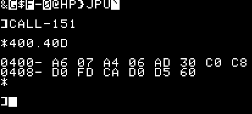
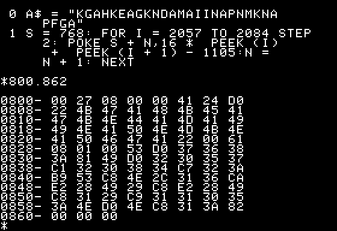
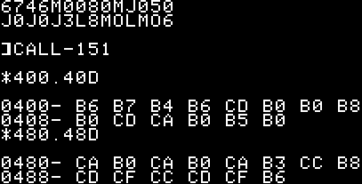

# SCRN/PLOT your 6502/ASM sound routine (or any other)
This article will explain a new (?) technique to poke ASM (machine language) subroutines using Applesoft (without using ``POKE``s at ALL) and actually spare several characters if you're into 2-liners.

## 6502 Subroutines in 2-liners
Because 2-liners have to be short (maximum 239 characters per line of code), 6502 subroutines used in 2-liners are usually short too. These routines might solve in a few bytes complex problems like generating a tune, scrolling a graphics screen or do a repetitive task best handled by machine code.

Most of the time these routines are called using the ``CALL`` statement and if it takes parameters those are ``POKE``d beforehand.

Because every character count, sometimes it's best to create "&" routines, USR() routines or routines that can be called in the form of ``CALL addr, param1, param2, ...``

## Generating sounds in 2-liners
Using a sound generating routine, we are going to see different techniques to interface assembly routines with Applesoft in the context of 2-liners.

The routines will be taken of the book "Assembly Lines" by Roger Wagner. The book is available freely as a PDF. It is a goldmine. I'm not sure if this is legal or not but whatever, here's the link to download a copy.
https://archive.org/details/AssemblyLinesCompleteWagner/mode/2up

### How it usually works
We all know that the speaker of the Apple II is rather limited. What's worse is that there's no way in Applesoft to generate other sounds than
- a beep, using ``PRINT CHR$(7)``
- a click, by accessing address 49200 (or -16336), for example using a ``PEEK`` or a ``POKE`` (the latter being shorter)

The latest technique is called 1-bit sound. It sends a voltage signal to the Apple speaker that will just produce a click because it has been "activated". It is 1-bit because it's either on or off: we're sending voltage or not.

To generate different tones we need to rapidly activate the speaker in two nested loops. The inner loop controls the pitch while the outer loop controls the duration ... 
This is usually done with some 6502 using delays between accesses to memory 49200 ($C030) ...

One of those routines is provided in Assembly Lines book by Roger Wagner (p. 57).

The routine is the following:
```
0300- A6 07     LDX $07     ; load value in X from byte $07 as duration
0302- A4 06     LDY $06     ; load value in Y from byte $06 as pitch 
0304- AD 30 C0  LDA $C030   ; activate the "speaker"
0307- 88        DEY         ; decrement the pitch value
0308- D0 FD     BNE $0307   ; until it reaches zero
030A- CA        DEX         ; decrement the duration
030B- D0 F5     BNE $0302   ; until it reaches zero
030D- 60        RTS         ; all done
```

Usage from Applesoft is then the following:
```
POKE 6, P: POKE 7, D: CALL S
```

Where P is the "pitch", D is the duration and S equals 768 ($300)...

## Integration with Applesoft: the regular way
If we want this routine available for Applesoft, we have to either load it from disk (which is not allowed in a 2-liner) or to POKE it into memory before usage.
Like this:
```
10 S=768: FOR L = 0 TO 13 : READ V : POKE S+L ,V : NEXT L: REM 38 + 1 character (":")
20 DATA 166, 7, 164, 6, 173, 48, 192, 136, 208, 253, 202, 208, 245, 96:  REM +53 chars = 92 chars
```

As you can see, this takes 92 characters if we were to use it in a 2-liner. 
And each call to generate a sound would take 21 additional characters assuming we use variables for pitch and duration:
```
POKE 6,P : POKE 7,D : CALL S
```

## Integration with Applesoft: relocation of routine in page zero
Can this be reduced ?
Well, first we could relocate it in page zero ... after all, it's only 14 bytes ... of course this all depends on what you need in page zero.
For example, bytes $34-$4F are used by Monitor, it is doubtful you have a need for it (but who knows) ... this would result in, 
for example (not all memory location work):
```
10 FOR L = 60 TO 73 : READ V : POKE L,V : NEXT L:  REM 31+1 chars
20 DATA 166, 7, 164, 6, 173, 48, 192, 136, 208, 253, 202, 208, 245, 96:  REM +53 chars = 85 chars
```
It's reduced to 85 chars ! But each call to generate a sound now takes 22 additional characters (because we didn't store the calling address in S).
```
POKE 6,P : POKE 7,D : CALL 60
```
This is still a lot of bytes just to emit an interesting (?) sound ...
## The main problem: 1-byte values expressed in 3 bytes

The data we have to poke, ranges from 0 to 255 ...
It means that in Applesoft, values above 9, will take 2 characters, while values above 99 will take 3 characters !
It feels like a waste when you know that a value of 100 could be represented either as
* a character (``d``) in ASCII, taking one byte to represent
* an hexadecimal value of ``64``, taking only 2 bytes to represent

Also using ``DATA`` requires colons to separate each value. This adds another character, so a value of 100 is actually taking 4 characters !

The DATA line itself in our example, if we omit "DATA", is 49 characters long for only 14 bytes worth !
Is it possible to reduce this ?

Here are the values again (49 characters, omitting spaces):
```
166, 7, 164, 6, 173, 48, 192, 136, 208, 253, 202, 208, 245, 96
```
In hexadecimal this becomes:
```
A6 07 A4 06 AD 30 C0 88 D0 FD CA D0 F5 60
```
This is only 28 characters if we omit spaces but 41 if we count spaces.

## PRINT a 6502 subroutine
Since ASCII is the shortest as it takes only 14 bytes, could we use ``PRINT`` to print the code in TEXT page 1 ?
If this code was in $400 (TEXT page 1), it would display like this:


There are 3 INVERSE characters (byte value < 64), one FLASH character (byte value between 64 and 127), 9 NORMAL characters (byte value between 160 and 255) and 1 non-``PRINT``able character (value between 128 and 159).
To reproduce this we would have to do the following:
```
10 HOME:                 REM   4 chars (not counted)
20 NORMAL:               REM   6+1 chars
30 ?"&G$F-0@HP}JPu":     REM +16+1 chars = 24 chars
40 POKE 1025,7: POKE1027,6: POKE1029,48: POKE1031,136: POKE1037,96     : REM +58 chars = 82 chars
```
This is still 82 characters, not counting the ``HOME`` instruction. This instruction is needed for the code to work but is usually there nonetheless in most 2-liners.

## PRINT using the 80-column card
If we have a 80-column card we can actually insert INVERSE and NORMAL statements by typing CTRL characters in the string to print.

Here's how:
```
10 HOME
20 ?"<CTRL-D>PR#3"       : REM 8+1 chars
30 ?"<CTRL-Q>&<CTRL-O>G<CTRL-N>$<CTRL-O>F<CTRL-N>-<CTRL-O>0<CTRL-N>@HP}JPu<CTRL-O>`<CTRL-N>"     : REM +26+1 chars = 36 chars
40 POKE 1031,136           : REM +12 chars = 48 chars
```

Explanation:
* ``?"<CTRL-D>PR#3"`` activates the 80-column card. A carriage return is needed for this command, that's why it's a separated statement. Once this has been executed, we are in 80 columns mode, it means every other character is actually in auxiliary memory, so we need to deactivate 80-columns mode ASAP but not the 80-column hardware.
* ``<CTRL-Q>`` CTRL-Q goes back to 40 columns mode with the 80-column hardware still active.
* ``<CTRL-O>`` every CTRL-O activates INVERSE mode
* ``<CTRL-N>`` while CTRL-N brings back NORMAL mode. Don't forget to end your string with a CTRL-N or you'll be in INVERSE mode after running the code
* ``<CTRL-O>`<CTRL-N>`` there is no FLASH when using the 80-columns hardware, but instead we have an extended INVERSE mode (that will print lower-case characters in INVERSE for example). The "flashing space" is actually represented by that apostrophe in INVERSE.
* ``POKE 1031,136`` so far we saved a lot of characters, unfortunately some characters cannot be ``PRINT``ed. That's the case of every value between 128 and 159 as well as the value 255. That's why we need to directly ``POKE`` these values in the appropriate memory spot.

(all these CTRL codes are explained in the 80-column cards manuals, for example [here on Asimov]( https://www.apple.asimov.net/documentation/hardware/video/Apple%20IIe%20Extended%2080-Column%20Text%20Card%20%28Rev%20B%29.pdf) )

The result is the following



As you can see the routine has been perfectly ``PRINT``ed into memory (+ that one ``POKE``). 

This technique is great if you have a 80-column card.

However, one must admit that typing all these CTRLs every time you modify your code is arduous. 

Of course as with every other ``PRINT`` instead of ``POKE`` technique, it means never scrolling the TEXT page or the routine would disappear. 

Also, TEXT display is noticeably slower when the 80-column card is activated. You could deactivate it by adding ``CHR$(21)`` at the end of the ``PRINT`` statement but it costs you 8 more characters. 

Well ... 48+8 = 56 characters. This is still outstanding.

Apart from needing a 80-column card, the main drawback to this technique is that for some routines, you'll need the help of a ``POKE`` or two because characters from $80->$9F (128 to 159) and $FF (255) cannot be ``PRINT``ed. 

In fact, we we're lucky that our routine does not have more bytes with a value between $80 and $9F because this is where all the ``STA``, ``STX`` and ``STY`` 6502 opcodes are and these are very common instructions.

It will then take 11-12 additional characters per un``PRINT``able character to ``POKE`` it plus one for the separating colon !

If you have two un``PRINT``able characters it will take 23-25 additional characters. This brings us to a total of 78-80 bytes ! A third un``PRINT``able character and we are reaching the 92 characters of the "classic" DATA/READ technique.

There must be a better more general way !

## POKEing Hexadecimal from Applesoft
Hexadecimal representation of bytes take only two characters, so it would be only 28 characters in the end. Of course Applesoft doesn't handle hexadecimal but maybe there are workarounds ?

### First, a bad idea
There are ways to send monitor commands via Applesoft but even the monitor does not accept less than 3 characters per byte, that is two characters for the byte plus one space like "300:16 07 14 06 AD 30 C0 88 D0 FD CA D0 F5 60".
Sending monitor commands via Applesoft works like this (see http://nparker.llx.com/a2/shlam.html for more info)
```
100 A$="300:A6 07 A4 06 AD 30 C0 88 D0 FD CA D0 F5 60 N D823G": REM  58+1 chars
110 FOR X=1 TO LEN(A$): POKE 511+X,ASC(MID$(A$,X,1))+128: NEXT: REM +52+1 chars = 112 chars
120 POKE 72,0: CALL -144 : REM + 17 chars = 129 chars
```
As you can see, this is worse !

The simple fact that we need 3 characters to "express" one byte is intolerable ...
What if we could use hexadecimal (without spaces) right in Applesoft code ?

### Using strings to hold hexadecimal and then compute the value
If we store our hexadecimal routine in a string we end up with this:
```
A$="A607A406AD30C088D0FDCAD0F560"
```
It's only 33 characters but as such it's unusable. We need to write code to parse the string and convert each hexadecimal to decimal.
Something along the way of (not optimized yet):
```
10 A$="A607A406AD30C088D0FDCAD0F560"
20 FOR I = 1 TO 28 STEP 2
30 N = VAL(MID$(A$,I,1)) * 16 + VAL(MID$(A$,I+1,1))     : REM THIS WILL NOT WORK !
40 POKE 768+I/2, N
50 NEXT
```
Line 30 will not work because whenever we have a letter in ``A$``, ``VAL()`` will return zero.
Line 30 is already 42 characters long and it will have to be more complex to handle A-F characters.
Instead of writing conditional code, we could change ``A$`` in such a way that the same computation is always applied.
Let's code ``A$`` to something else.
If we decide that hexadecimal "0" is coded as "A", "1" as "B", etc, we have the following:
```
10 A$="KGAHKEAGKNDAMAIINAPNMKNAPFGA"
20 FOR I = 1 TO 28 STEP 2
30 N = (ASC(MID$(A$,I,1))-65) * 16 + ASC(MID$(A$,I+1,1)) - 65
30 N = ASC(MID$(A$,I,1)) * 16 + ASC(MID$(A$,I+1,1)) - 1105
40 POKE 768 + I/2, N
50 NEXT
```
As you can see there are two lines 30. The second one is an optimization of the previous one.
If we combine line 40 and line 30 (``POKE 768+I/2, ASC( ...``) we have 112 characters !

Can we do better ?
### Using a string but without manipulating the string
Starting with our coded ``A$`` string, instead of using ``MID$()`` and ``ASC()`` to get the value to ``POKE``, we could "read" the value directly from it's location in the code.

```
0 A$="KGAHKEAGKNDAMAIINAPNMKNAPFGA" : REM 33+1 chars
1 S=768: FOR I = 2057 TO 2084 STEP 2: POKE S+N, (PEEK(I)-65)*16 + PEEK(I+1) - 65: N=N+1: NEXT: REM +74 chars = 108 chars
1 S=768: FOR I = 2057 TO 2084 STEP 2: POKE S+N, 16*PEEK(I) + PEEK(I+1) - 1105: N=N+1 : NEXT: REM +71 chars = 105 chars
```
(again the second line 1 is an optimization of the first).
Explanation:
The Applesoft code begins in \$800 (2048). The first letter ("K") after ``A$="`` is in location $809 (2057) in memory. We simply read those values directly from there.

Here's a screenshot of the code and how it's stored in memory.



* \$800: always $00
* $801-$802: memory location where the program's second line begins (the first line always begins in $803). The second line begins in $0827.
* $803-$804: line number (zero)
* $805-$826: the code of line zero
* $805: equals $41, that is ASCII #65, that is "A"
* $806: equals $24, that's ASCII #36, that's "\$"
* $807: equals $D0, this is not an ascii code, it's an Applesoft token representing "="
* $808: equals $22, that's ASCII #34, this is the quote sign (")
* $809-$824: our string in ASCII
* $825: the closing quote
* $826: $00 means this is the end of the line
* $827-$828: memory location for the third line (does not exist)
* $829-$830: line number (1)
* $831-$860: code for line 1
* $861-$862: memory location for the 4th line. As it's ``00 00`` it means there are no fourth line (and no third line either).

Anyway, all in all, our Applesoft code still takes 105 characters long !

There are variations to this technique: instead of having an assignment to a variable we could have a ``DATA``or a ``REM`` and access its precise memory location in the code. ``DATA`` is in fact shorter of 1 character (because you don't need quotes. ``REM``has the inconvenient of having to be used as the last statement of the line.

Anyway none of these variations are short enough.

Can we do better ? Of course.

## New technique: PRINT/PLOT hexadecimal
So here comes the technique I've developed for this particular case.

Notice that it can be used for all kinds of subroutines .... just be aware that we're "printing" routines and that the TEXT page lines are not sequential (line 1 is not in $400+40 chars). It works with any value from 0 to 255 and it's almost as easy as to type the actual hexadecimal values in the monitor.

This new (?) technique involves using four very simple instructions: PRINT, SCRN, COLOR and PLOT.

We will be using the GR/TEXT capabilities of Applesoft to poke a program in TEXT page 1.

How does it work ?
### PRINT
First we start from our 14 routine bytes: A6 07 A4 06 AD 30 C0 88 D0 FD CA D0 F5 60

We leave every number as it is, but we replace all the letters with new letters according to this:

A becomes J, B becomes K, C->L, D->M, E->N and F becomes O.

We now have J6 07 J4 06 JM 30 L0 88 M0 OM LJ M0 O5 60

We will now take advantage of the GR/TEXT screen and the SCRN function.

We are going to print every low-nibble (4 bits) of each char on line 1 of TEXT (which is line 0 of GR), this means we print "6746M0080MJ050"

And we will print every high-nibble of each char on line 2 of TEXT (which is line 2 of GR), this means we print "J0J0J3L8MOLMO6"

The result is the following:



If you watch closely, you'll notice that the low nibble is already in place in $400 for our first byte (we have the "6" of $A6) and that the low nibble of the value in $480 ("A" from $CA) is the value we need to place as the high nibble of our first byte.

We must find a way to leave unchanged the low nibble of each byte in line 1 and use the low nibble of each byte in line 2 as the high nibble of each byte in line 1.

### SCRN, COLOR & PLOT
As you know, SCRN will return the color of a "point" in Lo-res. You also know that one TEXT character is represented as 2 "vertical" points of various colors in lores.

Here's what our two PRINTs look like in GR:


You see 4 lines of colored points because we printed 2 lines of text.

The colors in line 0 correspond to the low-nibble (4 bits) of the bytes in $400->$40D while the colors in line 1 corresponds to the high-nibble of the bytes in the same range.

And of course, the same goes for lines 2 & 3... Now all we have to do is copy the points in GR line 2 (low-nibbles of bytes in $480-$48D) to line 1 (high nibbles of bytes in $400-$40D).

The result is that in line 0 and 1 of GR, we'll have our sound routine.

Here's the resulting code:
```
0 HOME: REM 4 chars (not counted)
1 ?"6746M0080MJ050": REM  17+1 chars
2 ?"J0J0J3L8MOLMO6": REM +17+1 chars = 36 chars
3 FOR I = 0 TO 13  : REM +10+1 chars = 47 chars     we're going to SCRN that TEXT line in VTAB 2
4 COLOR = SCRN(I,2): REM +15+1 chars = 63 chars     we have a value 0-15
5 PLOT I,1: REM +7+1 chars = 71 chars     we PLOT it on line 1, actually adding 16*color to the byte in $400+I
6 NEXT : REM +4 chars = 75 chars
```
Even with the "HOME" statement at first (which is needed but might already be included in your 2-liner), we have 75+4+1 chars = 80 chars

This is still better than the traditional POKE technique ...

This method can be used to POKE/PLOT longer routines ... just make sure to take into account the fact that one line is 40 chars max, so if you need to handle more bytes, simply add a embracing loop to repeat as needed ... don't forget you can do "NEXT I,J" instead of "NEXT:NEXT" !

Of course, if you need line 1 of TEXT or line 0 of GR, you'll see the routine ... it's probably better using Hires 2-liners....

Can we do even better ? Not that I know of if you try to use pseudo-hexadecimal in your code.


## One last thing

Roger Wagner's assembly lines contains another routine to handle sound that might be very useful for 2-liners.
Instead of using 
```
POKE 6,P: POKE 7,D: CALL 1024
```
it's using
```
CALL 1024, P, D
```

This means saving 12 characters every time you want to emit a sound.
However, the routine itself (see page 148 of the book) is not 14 bytes but 24 bytes. That's 10 bytes more.
If you want to output just one "unsual" sound (not CHR$(7) and not PEEK(49200)), use the 14 bytes routine.
But if you need more tunes, use the 24 bytes routine !

The 24 bytes routine uses 95 characters by itself ... it's almost as good as the "usual" routine we presented first that had 92 chars but it will take 9 characters less to call it !

```
10 HOME : REM 4 (not counted)
20 ? "0L7660L7676746M0080MJ050"   : REM  27+1
30 ? "24N8024N80J0J0J3L8MOLMO6"   : REM +27+1 = 56
40 FOR I = 0 TO 23   : REM +10+1 chars = 67
50 COLOR = SCRN(I,2) : REM +15+1 chars = 83
60 PLOT I,1 : REM +7+1 chars = 91
70 NEXT: REM +4 chars = 95

100 REM LET'S HEAR SOMETHING
120 FOR I = 0 TO 255
130 CALL 1024 , I, 10
140 NEXT
```

I hope you enjoyed this little tutorial on "how I did it" ! .... 

Can you do better than this ? If so, don't hesitate to post, I'd be happy to see what you've come up with !

---
#### Licence
See [license](LICENSE.md)
