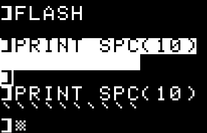

# Use SPC() to print any character !
## Introduction
You know how `SPC()` can be used to PRINT a number of space characters. For example `PRINT SPC(10)` will print 10 space characters.

Why didn't they allow to print something else than space characters ? It would have been interesting (?) to have the ability to repeat a sequence of any character. 

Maybe like `PRINT REPT("*",10)` would print 10 asterisks.

But Applesoft does not provide such an instruction. So are we doomed to use `PRINT "**********"`?

Here's a technique that will allow you to repeat any character, even in `FLASH` and `INVERSE` without using additional 6502 routines.

## Discovery
Let's see something weird ...

At the Applesoft prompt, type `FLASH`.

Then `PRINT SPC(10)`. You should now see 10 flashing space characters.
Now, press `CTRL-BREAK`. This exits the "flash" mode (do no type `NORMAL` !!).
Type `PRINT SPC(10)` again. And ...

WOW ! WHAT IS THAT ??
