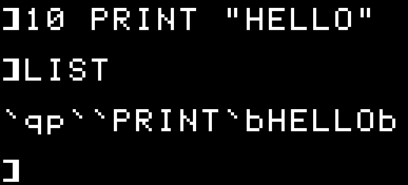
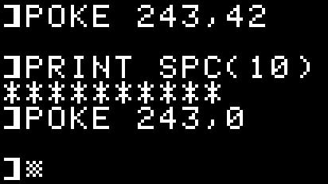
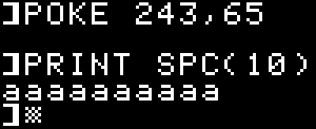
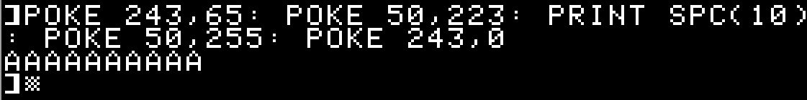
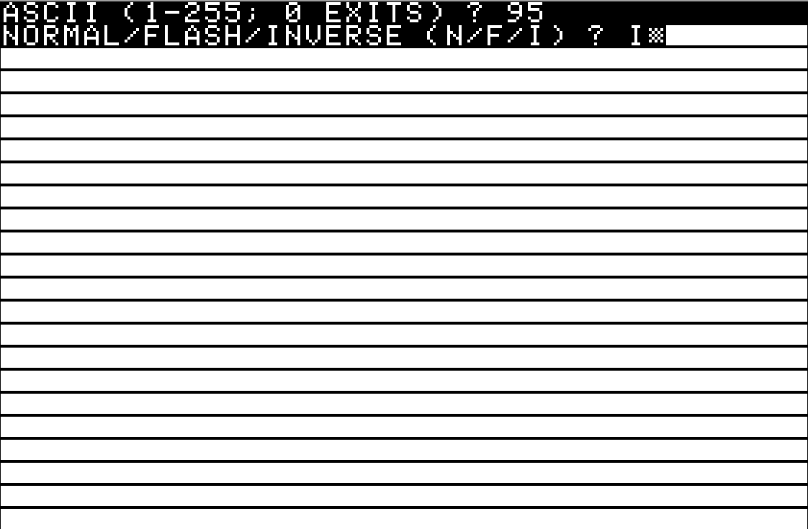

# Use SPC() to repeat any character !
## Introduction
You know how `SPC()` can be used to PRINT a number of space characters. For example `PRINT SPC(10)` will print 10 space characters.

Why didn't they allow to print something else than space characters ? It would have been interesting (?) to have the ability to repeat a sequence of any character. 

Maybe like `PRINT REPT("*",10)` would print 10 asterisks.

But Applesoft does not provide such an instruction. So are we doomed to use `PRINT "**********"`?

Here's a technique that will allow you to repeat any character, even in `FLASH` and `INVERSE` without using additional 6502 routines.

## Discovery
Let's see something weird ...

At the Applesoft prompt, type `FLASH`.

Then `PRINT SPC(10)`. You should now see 10 flashing space characters.
Now, press `CTRL-RESET`. This exits the "flash" mode (do no type `NORMAL` !!).
Type `PRINT SPC(10)` again. And ...

WOW ! WHAT IS THAT ??

What are those inverted single quote characters doing here ? "Something" has replaced space characters with those inverted single quotes ...

If you have a loaded Applesoft program, I encourage you to `LIST` it. If not, quickly type a short one and see the results ...

As you can see, something is messed up !

## Explanation
To understand what's happening here, you need to know how characters are printed on screen by Applesoft.

The general routine to print characters on screen is in `$DB5C`.
Here's the routine, taken from [S-C documentor website](http://www.txbobsc.com/scsc/scdocumentor/)

                   1950 *      PRINT CHAR FROM (A)
                   1960 *
                   1970 *      NOTE: POKE 243,32 ($20 IN $F3) WILL CONVERT
                   1980 *      OUTPUT TO LOWER CASE.  THIS CAN BE CANCELLED
                   1990 *      BY NORMAL, INVERSE, OR FLASH OR POKE 243,0.
                   2000 *--------------------------------
    DB5C- 09 80    2010 OUTDO  ORA #$80     PRINT (A)
    DB5E- C9 A0    2020        CMP #$A0     CONTROL CHR?
    DB60- 90 02    2030        BCC .1       SKIP IF SO
    DB62- 05 F3    2040        ORA FLASH.BIT   =$40 FOR FLASH, ELSE $00
    DB64- 20 ED FD 2050 .1     JSR MON.COUT "AND"S WITH $3F (INVERSE), $7F (FLASH)
    DB67- 29 7F    2060        AND #$7F
    DB69- 48       2070        PHA
    DB6A- A5 F1    2080        LDA SPEEDZ   COMPLEMENT OF SPEED #
    DB6C- 20 A8 FC 2090        JSR MON.WAIT   SO SPEED=255 BECOMES (A)=1
    DB6F- 68       2100        PLA
    DB70- 60       2110        RTS

The routine is called with the accumulator containing the character to print every time Applesoft needs to print something (like when using `PRINT` or `INPUT` or ... `SPC` !)

The routine that will effectively print the character on screen is `COUT` (in `$FDED`here named `MON.COUT`) but this routine here is the pre-treatment of the character to print.

As you can see, before calling `MON.COUT`, an `ORA` with zero-page memory `$F3` is executed. This `ORA` is needed to display characters in flash mode. The problem is that `$F3`, even after a `CTRL-RESET` is not reset and still contains `$40` (decimal 64), meaning that Applesoft is still (partially -- see below why) in flash mode.

But if it's in flash mode, how comes it prints NORMAL single quotes and not flashing characters ? Because `$F3` is just a mask and is not enough to flash the characters on screen. Another mask, in zero-page `$32` is also used, but this time by the `MON.COUT` routine. In fact `$32`is usually considered to be the memory that indicates if we are in normal (value `$FF`, decimal `255`), flash (value `$7F`, decimal `127`) or inverse (value `$3F`, decimal `63`) modes. But for the flash mode, the mask in `$F3` is equally primordial. In fact, even in normal and inverse modes, the value in `$F3 `has an impact since the `ORA` is called whatever the display mode is.

So, before any character is displayed on screen by Applesoft, two masking operations occur on the ASCII value of the character.

 1. an `ORA` with the value in `$F3`
 2. an `AND` with the value in `$32`

`CTRL-RESET` resets the value in `$32` to `255` ("normal" display mode) but it does not touch the value in `$F3`. That's why we have these display glitches if we `CTRL-RESET` after `FLASH`. 

Clearly, it's a bug.

When we press `CTRL-RESET` the system does a lot of resets, among them a call to SETNORM (`$FE84`) that restores the `$32` memory to `$FF`. Then a bit later it calls the routine pointed by the reset vector (`$3F2`), that is Applesoft's warm restart in `$E003` which in turns calls the `RESTART` routine in `$D43C`. This routine's main purpose is to display the `]` prompt and wait for the user to type a series of direct commands or a line of code. The only way I see we could fix this bug is by pointing the reset vector in `3F2` to a small routine that would reset `$F3` and then call the `RESTART` routine.

## Taking advantage of what we know
Of course Applesoft expects and uses some specific values in `$F3` and `$32`.

|  | NORMAL  | FLASH | INVERSE |
|--|--|--|--|
| **$32 (50)** |  $FF (255)| $7F (127) | $3F (63) |
| **$F3 (243)** | $00 (0)| $40 (64) | $00 (0)

Now, if we play a bit with the values in those two memory locations we will alter the way Applesoft displays characters on screen.

Two well-known (useless but kind of fun) examples are 

 1. `POKE 243,32` to lowercase everything, notably the `LIST` command. `POKE 243,0` will return to normal display.
 2. `POKE 50, 128` to sort-of disable printing. `LIST` and `CATALOG` will appear empty and the `]` prompt will disappear as well.

Notice that `POKE`ing in 243 influences only Applesoft and not the system ! That's because the `ORA $F3` only occurs within an Applesoft 6502 routine !

So ... `SPC()` is an Applesoft display routine. And as such, it will be influenced by both the values in `$32` and `$F3`. Now we just have to tweak those values to get expected results, that is, replace the space character by the character we want.

It turns out it's quite easy to do. You take the ASCII value of the character you want to display instead of the space character and you `POKE` it in `243` (`$F3`). 

For example, the asterisk has an ASCII value of `42` (or `$2A`), so we just do `POKE 243,42` and then `PRINT SPC(10)`. After that we restore the original state with `POKE 243,0`.

Wow that was easy ! We now have a REPEAT instruction in Applesoft !
Oh yeah ?

Of course, there's a small caveat. 

Remember that what happens behind the hood is that the space character (`$20`) is `ORA`'d with the value in `$F3`. 

 - `$20 ORA $2A `equals `$2A`. So, we're good.
 - `$20 ORA $61` ("a" lowercase character) equals `$61`. Still good. But ...
 - `$20 ORA $41` ("A" uppercase character) equals ... `$61` too ! Oh noo !

In fact it will not work with ASCII characters from 64 to 95, those are the uppercase letters, the `@` sign, the square brackets `][`, the backslash `\` ,  the caret `^` and the underscore `_` .

But all is not lost since we also have an `AND` mask to apply ! For now, we assumed its value was `$FF` (`255`), meaning it has no effect. But what if ...

`$20 ORA $41` ("A" uppercase character) equals `$61` but if we do `$61 AND $DF` (thus clearing bit 5), we have `$41` back !

So, for ASCII between 64 and 95, we have to change the value in `$32` as well and it has to be `$DF` (`223`).

(Notice how I immediately typed the `POKE`s to restore the normal display, otherwise my next commands would be partially invisible.)

Now we are able to use `SPC` to repeat any character available !

## One last thing ...
Ok, it works ... but only in NORMAL mode ! How do we make it work in FLASH and INVERSE ?

It's quite simple. I won't go into details on how it works but we just fiddle with the value in `$32`.

Basically what we do is subtract `128` (`$80`) from the value in `$32` if we want FLASH characters and subtract `192` (`$C0`) if we want INVERSE characters.

It works because bytes in the text screen memory (in `$400`) do not use the ASCII values of the characters. Byte values between 0-63 will display INVERSE characters (no lowercase characters), while values between 64-127 will display FLASH characters (no lowercase characters). Values above 127 are NORMAL characters (upper and lowercase). Now 255-192=63 (INVERSE) and 255-128=127 (FLASH) ... I suppose you got it.

Remember that not all characters are printable in FLASH or INVERSE.

## A little program to sum it all
This little program will demonstrate what we learned here.

It will fill the screen with one kind of character, using four `SPC` statements with a parameter of 240.

    10 HOME
    20 X = 255: Y=0: REM INIT VALUES
    30 POKE 243,0: REM RESET ORA MASK
    40 POKE 50, X: REM RESET AND MASK
    50 VTAB 1
    60 INPUT "ASCII (1-255; 0 EXITS) ? ";Z
    70 IF NOT Z THEN END
    80 INPUT "NORMAL/FLASH/INVERSE (N/F/I) ? ";N$
    90 IF N$ = "F" THEN Y=128
    100 IF N$ = "I" THEN Y=192
    110 IF (Z>=64 AND Z<=95) OR (Z>=192 AND Z<=223) THEN X = 223: REM PREPARE END MASK FOR ASCII 64-95 OR 192-223
    120 POKE 50,X-Y: REM SET NORMAL/FLASH/INVERSE MASK
    130 POKE 243, Z: REM SET ORA MASK
    140 VTAB 1
    150 PRINT SPC(240): REM FILL THE SCREEN !
    160 PRINT SPC(240)
    170 PRINT SPC(240)
    180 PRINT SPC(240)
    190 GOTO 20

# HAPPY CODING !
