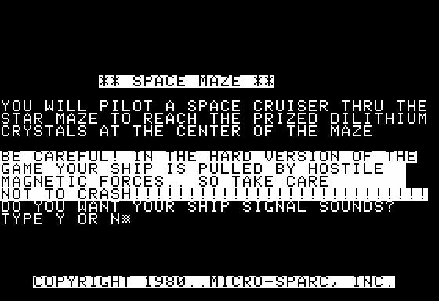
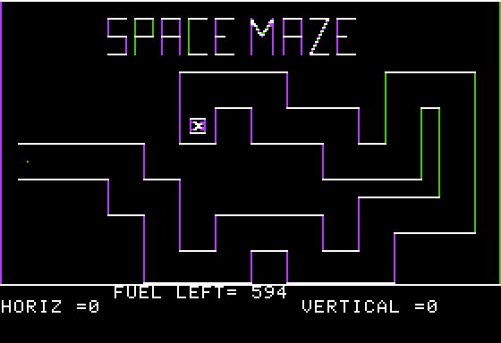
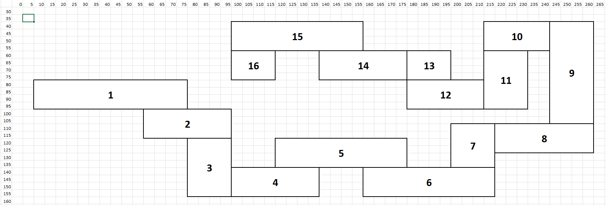

# Honoring The Code, part 1: Space Maze
Space Maze by Micro-Sparc, as published in Nibble Magazine #1, Jan-Feb 1980.

## Summary
* [Introduction](#introduction)
* [Overview](#overview)
* [How the code works](#how-the-code-works)
* [Fixing the game](#fixing-the-game)
* [Further optimization](#further-optimization)

## Introduction
For this first episode I've chosen the very first issue of Nibble magazine, dating back to Jan-Feb 1980 ! Were you one of the lucky one to own a copy of this issue back then ? Well, I wasn't. At the time, I was only 5 and I'm not even sure we had an Apple II at home then. And also, Nibble was a US magazine that came to Europe (I'm from Belgium) mostly through their Nibble Express compendiums.

Although I did not have this issue, for a reason or another, the program we'll be talking about came to me through a disk(ette) of various basic programs. I remember vividly the graphics and the Star Wars music. Unfortunately, as we will see, the game is terrible. It's terrible today but it was also terrible back then.

Let me present you **SPACE MAZE** !

## Overview

Here's a link to the DSK file that contains the original code (and all the other code we're going to create): [htc1_spacemaze.dsk](./files/htc1_spacemaze.dsk)

Simply RUN SPACE MAZE from the DSK ...

Here are two screenshots of the game...

Instructions:



Starting screen:



The objective of the game is to move your spaceship (represented by a dot) to the end of the maze as fast as possible without crashing in the walls of the maze.
Using the Apple II (analog) joystick, you carefully give your spaceship direction and speed and try to go as far as possible. You also have to make sure you don't go out of fuel: even when you're not moving your fuel runs fast, so you have to hurry.

In itself the game concept is simple and it's not very original even for the time but the idea that this game is Applesoft only (and really short in fact) is appealing. Unfortunately the joystick control is very hard to master and even in "Easy" mode (there's a "Hard" mode where your ship is sometimes pulled in a random direction) it's nearly impossible to beat. And once you beat the game, you're forced to play in Hard mode and the only thing you can do is try to break your hiscore (which means reach the end of the maze in a shorter time).

The main problem with the game is that it's not very responsive. You can turn on sound and your ship will emit a beep every time it has moved from one point to another and by hearing the beat of the beep you know that the code is too slow to offer responsive controls.

## How the code works
Here's the full original code: [spacemaze.bas](./files/spacemaze.bas)

The main game routine is in lines 100-300.

Lines 100-175 will detect if the spaceship is out of the maze corridors. It's a serie of IF/THEN checking if the spaceship is within the maze boundaries.

Lines 210-300 will manage the spaceship movement (reading the joystick), plotting/unplotting the spaceship dot and also print the fuel level and spaceship coordinates.

How does the program check if the spaceship has hit a wall ? My intuition was that maybe the program used the "collision counter" in $EA (234) but this only works with Hires Shape Tables (you know DRAW/XDRAW routines to draw 2D vector shapes in hires). What it does is more simple: as the maze is hardcoded, the code checks if the spaceship is within one of the maze rectangles sections. This is what lines 100-162 do. They check every rectangle and set a variable Z that contains the rectangle number where the spaceship is (among 16 rectangles).

Here's a representation of the 16 rectangle zones the maze is made of.


The main problem is that the code goes through ALL of the coordinates testing for EACH rectangle zone EVERY time, even if it has found already found the zone where the spaceship is. Each of these tests is made of 4 conditions (testing 2 limits of X and then 2 limits of Y). That's 4x16=64 conditions in a row ... and this is killing the game.

16 consecutive lines like this one will kill the game: 
```basic
100  IF (X >  = 10 AND X <  = 80) AND (Y >  = 80 AND Y <  = 100) THEN Z = 1
```

It should be noted that although Z holds the zone number where the spaceship is, this variable is not used for anything else but testing if it's non-zero (in which case the spaceship is in none of the zones, thus out of the maze) and also that Z is not even properly set as lines 135 to 142 all set Z to 6 as if it was the same zone. Also, the comments indicate that there are 11 zones when in fact there are 16. It looks like during the development the maze was modified from 11 to 16 zones. And one last thing, some zones limits overlap but that's ok.

## Fixing the game
So the first thing that comes to mind is that once you know in which zone the spaceship is, you need to skip all the other tests. Simply putting a "GOTO 175" at the end of each test line is enough. Running the program with the sound on for the spaceship will prove you that this was really the main bottleneck ! You can already notice how the spaceship is now much more responsive.

```basic
100  IF (X >  = 10 AND X <  = 80) AND (Y >  = 80 AND Y <  = 100) THEN Z = 1: GOTO 175
 110  IF (X >  = 60 AND X <  = 100) AND (Y >  = 100 AND Y <  = 120) THEN Z = 2: GOTO 175
 120  IF (X >  = 80 AND X <  = 100) AND (Y >  = 120 AND Y <  = 158) THEN Z = 3: GOTO 175
 125  IF (X >  = 100 AND X <  = 140) AND (Y >  = 140 AND Y <  = 158) THEN Z = 4: GOTO 175
 130  IF (X >  = 120 AND X <  = 180) AND (Y >  = 120 AND Y <  = 140) THEN Z = 5: GOTO 175
 135  IF (X >  = 160 AND X <  = 220) AND (Y >  = 140 AND Y <  = 158) THEN Z = 6: GOTO 175
 137  IF (X >  = 200 AND X <  = 220) AND (Y >  = 110 AND Y <  = 140) THEN Z = 6: GOTO 175
 138  IF (X >  = 220 AND X <  = 265) AND (Y >  = 110 AND Y <  = 130) THEN Z = 6: GOTO 175
 139  IF (X >  = 245 AND X <  = 265) AND (Y >  = 40 AND Y <  = 110) THEN Z = 6: GOTO 175
 140  IF (X >  = 215 AND X <  = 245) AND (Y >  = 40 AND Y <  = 60) THEN Z = 6: GOTO 175
 141  IF (X >  = 215 AND X <  = 235) AND (Y >  = 60 AND Y <  = 100) THEN Z = 6: GOTO 175
 142  IF (X >  = 180 AND X <  = 235) AND (Y >  = 80 AND Y <  = 100) THEN Z = 6: GOTO 175
 145  IF (X >  = 180 AND X <  = 200) AND (Y >  = 60 AND Y <  = 100) THEN Z = 8: GOTO 175
 150  IF (X >  = 140 AND X <  = 180) AND (Y >  = 60 AND Y <  = 80) THEN Z = 9: GOTO 175
 160  IF (X >  = 100 AND X <  = 160) AND (Y >  = 40 AND Y <  = 60) THEN Z = 10: GOTO 175
 162  IF (X >  = 100 AND X <  = 120) AND (Y >  = 60 AND Y <  = 80) THEN Z = 11: GOTO 175
 ```

Test for yourself, here's the full code: [spacemaze_quickfix.bas](./files/spacemaze_quickfix.bas)

You may also load it from the DSK file: [htc1_spacemaze.dsk](./files/htc1_spacemaze.dsk) (file "SPACE MAZE QUICK FIX")

There's one drawback, however: the game will slow down as your spaceship enters more and more deeply into the maze. This is because we always check if the spaceship is in zone 1, then if not, check if it's in zone 2, then if not, check if it's in zone 3, etc. Once we're in zone 16, it will be like we didn't change anything to the code. We've seen that these tests take time and they should be reduced to a minimum.

So why not use the value of Z to check only what is needed ? Since you're on zone Z, you can only go on zone Z-1 or zone Z+1. So all we have to do is use "ON Z GOSUB" and check for zone Z-1, zone Z and then zone Z+1 and if all failed, it means we're out of the maze.

So, let's rewrite line 300 with ON GOSUB
```basic
 300 XO = X:YO = Y: ON Z GOSUB 100, 100, 110, 120, 125,130,135,137,138,139,140,141,142,145,150,160: GOTO 210
```

What this will do is that if Z equals 1, we GOSUB to line 100 and test if we are still in zone 1 or if we moved to zone 2 (which are the only two possible zones where our spaceship can be). If not, then we crash. If Z equals 2, we GOSUB again to line 100 and test if we've moved back to zone 1, are still in zone 2 or moved into zone 3 (it's impossible to be in any other zone so all the other tests will fail and we will crash), etc.

Lines 100-165 need to be altered so that the zone numbers are correct and so that we return from the calling ON GOSUB asap. Also we need to invert line 162 and 165 otherwise we cannot win the game.
```basic
 100  IF (X >  = 10 AND X <  = 80) AND (Y >  = 80 AND Y <  = 100) THEN Z=1: RETURN
 110  IF (X >  = 60 AND X <  = 100) AND (Y >  = 100 AND Y <  = 120) THEN Z=2: RETURN
 120  IF (X >  = 80 AND X <  = 100) AND (Y >  = 120 AND Y <  = 158) THEN Z=3:  RETURN
 125  IF (X >  = 100 AND X <  = 140) AND (Y >  = 140 AND Y <  = 158) THEN Z=4:  RETURN
 130  IF (X >  = 120 AND X <  = 180) AND (Y >  = 120 AND Y <  = 140) THEN Z=5:  RETURN
 135  IF (X >  = 160 AND X <  = 220) AND (Y >  = 140 AND Y <  = 158) THEN Z=6:  RETURN
 137  IF (X >  = 200 AND X <  = 220) AND (Y >  = 110 AND Y <  = 140) THEN Z=7:  RETURN
 138  IF (X >  = 220 AND X <  = 265) AND (Y >  = 110 AND Y <  = 130) THEN Z=8:  RETURN
 139  IF (X >  = 245 AND X <  = 265) AND (Y >  = 40 AND Y <  = 110) THEN Z=9:  RETURN
 140  IF (X >  = 215 AND X <  = 245) AND (Y >  = 40 AND Y <  = 60) THEN Z=10:  RETURN
 141  IF (X >  = 215 AND X <  = 235) AND (Y >  = 60 AND Y <  = 100) THEN Z=11:  RETURN
 142  IF (X >  = 180 AND X <  = 235) AND (Y >  = 80 AND Y <  = 100) THEN Z=12:  RETURN
 145  IF (X >  = 180 AND X <  = 200) AND (Y >  = 60 AND Y <  = 100) THEN Z=13:  RETURN
 150  IF (X >  = 140 AND X <  = 180) AND (Y >  = 60 AND Y <  = 80) THEN Z=14:  RETURN
 160  IF (X >  = 100 AND X <  = 160) AND (Y >  = 40 AND Y <  = 60) THEN Z=15:  RETURN
 162  IF (X >  = 106 AND X <  = 114) AND (Y >  = 66 AND Y <  = 74) THEN 3000: REM  BRANCH TO WIN
 165  IF (X >  = 100 AND X <  = 120) AND (Y >  = 60 AND Y <  = 80) THEN Z=16:  RETURN
```
Line 170 does not need to check if Z=0. If we reach line 170 it means we crashed and we can GOTO 4000 immediately.
```basic
170  GOTO 4000
```
also we can get rid of line 175 as we'll never reach it.

And that's it ! the game is now smoothier and more responsive. Obviously it goes faster but despite that it's in fact easier to maneuver the spaceship.

The whole modified code is here: [spacemaze_quickfix2.bas](./files/spacemaze_quickfix2.bas)

And it can be run from the DSK as "SPACE MAZE QUICK FIX 2"

## Further optimization

This was the main modification that needed to be done in order to "fix" the game but in fact we can do much more if we want to continue optimization.
Without going up until the point where all variables names are one letter only, we can optimize some stuff.

1) we can replace the ON GOSUB with an ON GOTO and replace all the RETURNs we've just typed with GOTO 210 as this is what will happen anyway when we return. It means we gain some cycles as the memory address of the next statement does not have to be saved on the stack.
2) As is, the code goes 16, 8 or 5 times faster than the original: if we go back one zone, it will go 16 times faster (only 1 line of 4 conditions is checked instead of 16), if we stay in the same zone, it goes 8 times faster (2 lines of 4 conditions instead of 16) and if we go to the next zone, it goes 5 times faster as we parse 3 lines of 4 conditions instead of 16. This can be improved if we repeat the same conditions and test first if we are in the actual zone (which is what happens most of the time), then if we are going to the next zone (which happens more than going back to the previous zone), then only check if we are back to the previous zone.
3) the sound routine uses two memory addresses to indicate the pitch and the duration of the note being played. The pitch is stored in 780 ($30C), while the duration is in 781 ($30D). The pitch is not modified by the sound routine while the duration is decreased by the sound routine. So when it's time to utter the spaceship beep, we only need to reset back the duration and thus not bother with the pitch (removing one POKE).
4) to test for difficulty, the program checks the value of the HD$ variable which holds either "H" (hard) or "E" (easy). It's more efficient to check for a number. So we need to replace this check with a numeric variable.
5) same thing for the spaceship sound, instead of checking for a string variable to see if we must emit a beep, we should check for a numeric variable.
6) every game cycle, the coordinates of the ship, the fuel left and the hi-score are printed on the screen, and for most of these lines, the programmer used a CALL-868 which clears the line from the cursor to the end of the line. This is inefficient when all you're printing are numeric values. Simply append a space to the numeric value is enough to delete any extra character as those values only increment/decrement by a step of 1. Also the hiscore should be printed once at the start of the game and never again until the next game. 
7) Lines 15 to 50 should be moved at the end of the program as they are used only once. As a rule for any action game in Applesoft: your main game cycling routine should be at the top of the program as any GOTO/GOSUB will search the line number to reach from the top. This is also why the comments at the top should be moved at the end of the program.
8) I don't know why but the programmer used a lot of CALL-936 which is exactly the same as the HOME command except it's parsed using a few more cycles. Fortunately these calls are not made during the game but CALL-936 is much less readable than HOME. So there's a double reason not to use it.
9) I have stored common integer values like 49152 in variables as this speeds the parsing. With such a long integer, Applesoft reads 5 numeric characters and transform their ASCII representation to its own numeric format. By using a variable, Applesoft only parse one character (the variable names) and it points to an address in memory where the value is already formatted and ready for use.
10) The rest of the modifications I've made are either aesthetic or practical ones: 
 - always try to prompt the user the same way (you either use "Type Y/N" or "Type 'Y' or 'N'" but not both)
 - the star wars music is removed from the intro screen as it's really ... dull nowadays :) but you can still ask the program to play it at the start of the game
 - I've modified some sounds here and there
 - pressing enter when giving choices will default to appropriate values (at least for me) highlighted by INVERSE characters.
 - I've added keyboard support, for now the game is easier in that mode than with the joystick but maybe we can alter that a bit in a future version ?

All in all, here's the full modified code: [spacemaze_htc_v1.bas](./files/spacemaze_htc_v1.bas) 

You can run it from the DSK as "SPACE MAZE HTC V1"

It certainly can be optimized a little bit more but unless you change the fundamentals of the game (either the game itself or the inner workings) you won't see much difference with any further optimization.

