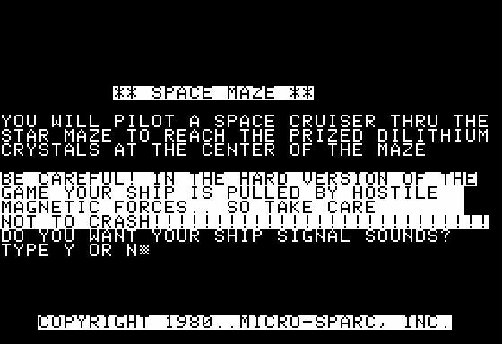
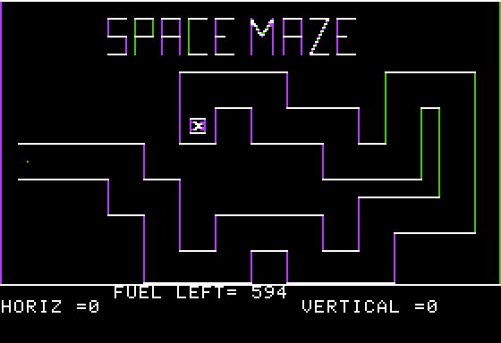

# Honoring The Code, part 1: Space Maze
Space Maze by Micro-Sparc, as published in Nibble Magazine #1, Jan-Feb 1980.

For this first episode I've chosen the very first issue of Nibble magazine, dating back to Jan-Feb 1980 ! Were you one of the lucky one to own a copy of this issue back then ? Well, I wasn't. At the time, I was only 5 and I'm not even sure we had an Apple II at home then. And also, Nibble was a US magazine that came to Europe (I'm from Belgium) mostly through their Nibble Express compendiums.

Although I did not have this issue, for a reason or another, the program we'll be talking about came to me through a disk(ette) of various basic programs. I remember vividly the graphics and the Star Wars music. Unfortunately, as we will see, the game is terrible. It's terrible today but it was also terrible back then.

Let me present you **SPACE MAZE** !

## Overview

Here's a link to the DSK file that contains the code (among others): https://archive.org/download/nibbledisks_nib01/nib01.dsk

And here are two screenshots of the game...

Instructions:

Starting screen:

The objective of the game is to move your spaceship (represented by a dot) to the end of the maze as fast as possible without crashing in the walls of the maze.
Using the Apple II (analaog) joystick, you carefully give your spaceship direction and speed and try to go as far as possible. You also have to make sure you don't go out of fuel: even when you're not moving your fuel runs fast, so you have to hurry.

In itself the game concept is simple and it's not very original even for the time but the idea that this game is Applesoft only (and really short in fact) is appealing. Unfortunately the joystick control is very hard to master and even in "Easy" mode (there's a "Hard" mode where your ship is sometimes pulled in a random direction) it's nearly impossible to beat. And once you beat the game, you're forced to play in Hard mode and the only thing you can do is try to break your hiscore (which means reach the end of the maze in a shorter time).

The main problem with the game is that it's not very responsive. You can turn on sound and your ship will emit a beep every time it has moved from one point to another and by hearing the beat of the beep you know that the code is too slow to offer responsive controls.

## How the code works
Here's the full original code: [spacemaze.bas](./spacemaze.bas)

The main game routine is in lines 100-300.
Lines 100-175 will detect if the spaceship is out of the maze corridors
Lines 210-300 will manage the spaceship movement (reading the joystick), plotting/unplotting the spaceship dot and also print the fuel level and spaceship coordinates

How does the program check if the spaceship has hit a wall ? My intuition was that maybe the program used the "collision counter" in $EA (234) but this only works with Hires Shape Tables (you know DRAW/XDRAW routines to draw 2D vector shapes in hires). What it does is more simple: as the maze is hardcoded, the code checks if the spaceship is within one of the maze rectangles sections. This is what lines 100-162 do. They check every rectangle and set a variable Z that contains the rectangle number where the spaceship is (among 16 rectangles).
