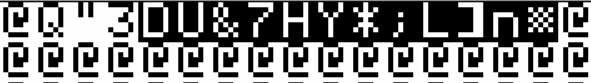

# Honoring The Code, part 2: Applesoft Tetris in Lo-Res
# Summary
- [Discovering the game](#discovering-the-game)
- [Reviewing what's wrong](#reviewing-whats-wrong)
- [Fixing the main bottleneck](#fixing-the-main-bottleneck)
	- [PLOT two pixels with one instruction](#plot-two-pixels-with-one-instruction)
	- [PLOT 8 pixels with one instruction](#plot-8-pixels-with-one-instruction)
	- [Are we fast enough ?](#are-we-fast-enough-)
	- [A small setback](#a-small-setback)
	- [Final PRINT optimizations](#final-print-optimizations)
- [Optimizing arrays](#optimizing-arrays)
	- [In the code: offsets to cells](#in-the-code-offsets-to-cells)
- [Reading key strokes and branching accordingly](#reading-key-strokes-and-branching-accordingly)
	- [Doing it without the ASCII array](#doing-it-without-the-ascii-array)
	- [Doing it with the ASCII array, but without the IF and the subtraction](#doing-it-with-the-ascii-array--but-without-the-if-and-the-subtraction)
	- [The fastest way](#the-fastest-way)
- [Spaghetti code](#spaghetti-code)
- [Little optimizations](#little-optimizations)


## 🍎Discovering the game
Recently I came across this page on paleotronic.com: 
https://paleotronic.com/2018/06/26/tetris-for-applesoft-basic/

It features a Tetris-clone written in Applesoft in lo-res graphics. The code is rather well-documented but unfortunately it cannot be copy/pasted as it's proposed as png files. However, the author has provided a DSK file on archive.org.

https://archive.org/details/AppleSoftTetris

Ok, So let's run it.

(a bit later ...)

You must certainly admit that this game does not do the Apple II justice. First of all, it's painfully **slow** and hideously flickery. Then there are several little bugs: for example, you can rotate only in one direction (despite what the page in archive.org says). Also, you can't go to the next level as there's no code for that ! 

Why has this code been showcased in the Paleotronic magazine ? Have they tried it ? And if they did, did they like the game ?

Despite the awful speed, it seems like the author tried to optimize his code by using some known tricks, as pointed out by Paleotronic magazine:
- use variables instead of hardcoded constants
- do `GOTO/GOSUB`s as much as possible to the top of the program

Unfortunately these optimizations are not consistent throughout the code and many constants are still hardcoded while the many `GOTO/GOSUB`s contribute to an ineffective spaghetti main game loop.

If you replace line 100 so that it `GOSUB 350` directly (thus removing the speed delay due to the game level), the main game loop takes **456000 cycles** only to let a piece fall down one position ! 

As a comparison, the `HGR` command takes 278497 cycles. It means that just to draw a piece falling down from one position to the next, **it takes almost as long as two consecutive `HGR`s** ! And you know how `HGR` is slow because you can actually **see** how slowly it erases the hi-res screen when you run the command.

One very good thing, again pointed out by Paleotronic magazine, is that the author used a clever technique to store the pieces (maybe this is how they do it in the original Tetris code ? I don't know). A bunch of `DATA` statements list all the possible orientation of the seven Tetris pieces/shapes. But instead of being data of what to draw, it's data to the 4 cells that each piece is made of, as offset coordinates.

The seven pieces of Tetris are **all** made of 4 cells. The "widest" piece is the piece known as `I` (the bar) ... It's 4 cells wide when lying down and 4 cells high when standing up. So one could be tempted to describe the 7 pieces as seven 4x4 matrices. Not only is this memory-ineffective, it's also not appropriate because before rotating a piece you need to know if it has enough space to actually rotate.

So the author chose to `PLOT` 4 cells of each piece using offset coordinates. For example, the `I` (bar) piece has the following X/Y offsets (0,1) (1,1) (2,1) and (3,1) when it's lying down, and (1,0) (1,1) (2,1) (3,1) when it's standing up.

The nice thing is that these coordinates can be used to draw the shape (and you might think it should be quick as there's only 4 pixels to plot) but also check if it's possible to rotate it or simply move it to the next position.

Unfortunately, the way the pieces are drawn on the screen will completely destroy any hope for speed: the author wanted to make his Tetris *square*. However, the pixels in lo-res are *rectangular*. So instead of plotting 4 pixels per piece he's plotting the double. To speed it up a little he uses `VLIN` instead of two consecutive `PLOT` instructions (which **is** better). But unfortunately this is not enough. This aesthetic choice, while understandable, is the most important bottleneck.

## 🍎Reviewing what's wrong
So what can be done, if anything ?

First, let's review the main bottlenecks and what could be done (in no particular order). Some of these might seem worthless to you, but remember that every cycle won means a faster game. Small streams make big rivers.

- `VLIN` is used to draw two lo-res pixels vertically. This is the main bottleneck.
	- This requires a change of strategy. See next section for details.
- Spaghetti code (too many `GOTO/GOSUB`s in all directions -- if you try to follow it manually, it will be hard to say where a `RETURN` will take you back to)
	- Fixes:
		- rewrite the main loop in a more straightforward/logical way
		- stop using `GOSUB`s. It's not that they're slower per se, but for such a small game/code, it's ~~best~~ **much faster** to duplicate code rather than use subroutines
- `GOTO/GOSUB`s are not thought to be effective enough
	- Fix:
		- `GOTO/GOSUB` should go to a line that's either as much as 	possible:
			- near to the start of the program
			- near to a line that's above or equal to the next multiple of 256 (explanation for this later in this article).
- Many hardcoded constants in the code. Every iteration of the game loop, Applesoft takes time to "decipher" these constants and turn them to temporary variables
	- Fix: replace **all** hardcoded constants with actual variables
- Most used variables are not declared first. Applesoft's list of variables is not alphabetical: first encountered variables are the first in the list. Searching the list will thus find first declared variables faster.
	- Fix: declare most used variables first
- Code uses `FN` which calls a "function" with one parameter and returns a value. `FN` is faster than a `GOSUB` in most situations, but using the same code **inline** is `much` faster.
	- Fix: It's faster to duplicate the same code instead of using `FN/GOSUB`.
- The code uses many arrays (which are slow per se, the more dimensions the slower)
	- Fix: remove arrays where possible		
	- Fix: refactor two dimension arrays to one dimension arrays whenever possible (favor arithmetic for a single index instead of two indices)
	- Fix: use a temp variable when the same array item is used more than once in the code
- The code to check for keypresses uses a large array named `E()`, with a size of 128 items, one for each ASCII code. The value in the array range from 0 (key is not used) to 6 (6 possible actions: left/down/right/rotate left/rotate right/quit). Values 1-6 are used in a `ON E(K) GOTO` statement that will branch the code to 6 subroutines to handle each keypress. The idea is interesting but badly implemented because `K` is manipulated way too much before being used in the `ON GOTO`.
	- Fix: use a faster way to handle keypresses.
- Code uses multiplication by 2
	- Fix: always use addition on itself when multiplying by 2
- Many two-letters variables' names
	- Fix: exhaust one-letter variables first, for most used variables first.
- There's a modulo check in there (on division by 4 on line 360)
	- Fix: most of the time, it's possible to avoid a modulo check by using temp variables and simple arithmetic; but as you'll see, in the end, the refactored code won't even need a modulo check

## 🍎Fixing the main bottleneck
The most important bottleneck is these `VLIN`s to draw two vertical identical pixels in lo-res. If we want to do it in **pure Applesoft**, what can be done ?

There are only two solutions:
1. accept an aesthetic depreciation and plot rectangular cells
2. find a faster way to plot two pixels

There would be no shame in solution #1. The game would look a little bit squashed but it could still be fun. Or maybe it could be horizontal instead of vertical ? After all, Steve Wozniak wrote his "Little Brick Out" game in Integer Basic as a horizontal Break Out game.

What about solution #2 ? How can we draw two vertical pixels faster ?

### 🍎PLOT two pixels with one instruction

We know that `PLOT X,Y: PLOT X,Y+1` is slower than `VLIN Y, Y+1 AT X`. So we're out of options, no ? There are no more instructions to plot pixels on the lo-res screen, no ? 

You're right but you're forgetting something: what we plot on the lo-res screen actually shows on the text-screen too because the lo-res and text screen share the same memory location: $400-$7FF.

And, **miracle**, two vertical pixels on even horizontal coordinates correspond to one character on the text screen. You've seen it before: type `GR` and then `TEXT` and 4/5 of your screen will be filled with `@` characters in `INVERSE`.

Maybe we can do the opposite: `PRINT` characters while in `GR` ?
Let's try it:
```basic
GR
VTAB 1: PRINT "HELLO": VTAB 21
```
You've just plotted some pixels on the lo-res screen. 


The first lo-res line is now made of one brown pixel (`H`), one gray (`E`), two green (`LL`), one white (`O`). The second line will be all green.

With just one `PRINT`, we've changed two lines of pixels ! Every character printed is represented by two colors on the lo-res screen. And it seems like L prints two green vertical pixels ! Great ! It means that we could do `PRINT "L"` whenever we want to draw a green cell !

Ok, we need to analyze this a bit further. Still in GR/mixed text mode (If not, retype the previous two commands). Now type `CALL-151` and then `3FF` and press RETURN twice. You should see this:

    0400- C8 C5 CC CC CF 00 00 00

This is the first line of the text/lo-res screen. Each of these hex codes correspond to one of the letters in "`HELLO`". But right now, as we're in lo-res, it corresponds to lo-res colors.

The hi-nibble of each byte (the first "hex character" in each byte) is the color for lo-res line 1. Each of these have the value "C" (decimal 12). Color 12 is light green.

The lo-nibble of each byte (the second "hex character") is the color for lo-res line 0. We have 8 (brown), 5 (grey #1), C (decimal 12, light green) twice and F (decimal 15, white).

Ok, now the problem is that we want "square" color cells, so what we need is to have the same value for the lo and hi-nibble. Still in the monitor, type:

    400: 00 11 22 33 44 55 66 77 88 99 AA BB CC DD EE FF

You should now have lines 0-1 of the lo-res screen with all possible lo-res colors.


We already know that `PRINT`ing an "`L`" is the same as writing (`POKE`ing) `$CC` in the text/lo-res memory (`$CC` is decimal 204 -- `POKE 1024, 204` for instance will plot two light green pixels in 0,0 and 0,1)

But is it possible to `PRINT` all these values ? Why is "L" equivalent to `$CC` (decimal 204) when we know that its ASCII code is 76 (hex `$4C`) ?

To understand that we need to see how Applesoft (and the Apple II) outputs characters on the screen.

When Applesoft encounters a statement like `PRINT "L"`, it will convert the `L` character to its ASCII code (decimal 76, hex `4C`) and turn the 7th-bit (called the "hi-bit") of this value to 1. In practice, it means that all ASCII characters have now a value 128 higher. For `L`, we have 76+128=204.

If the original value is below 32, it means it represents a "Control" character (a character that is a combination of the CTRL-key and a few selected characters, mostly the alphabet, but not the numbers !), for example CTRL-G (to beep the computer) or CTRL-H to go down one text line.

If the "new" value is above 160 (128+32), it means the original value was NOT the one of a control-character and Applesoft will apply a "mask" (called the "FLASH" mask) that will turn the 6th bit on if the `FLASH` text mode is on (or do nothing if it's not). 

From there, Applesoft gives control to the Monitor ROM to handle the character to print and to set the horizontal/vertical position of the next character to print.

The Monitor ROM print routine will check the value we have so far. If the value is equal or above 160 (128+32), it means the character can be printed on screen ("not a control-character") and it will apply another mask (called the "INVERSE" mask although it also involves the FLASH mode). 

If `INVERSE` was set, then the mask will clear bits 6 and 7 of our value, reducing it to a value between 0 and 64 ($0 to $3F), effectively printing in INVERSE. 

If `FLASH` was set, then the mask will clear only bit 7, and the value will be between 64 and 127 ($40 to $7F) effectively printing in FLASH.

All in all, we will have various values depending on the INVERSE and FLASH masks.

- Values from 0 to 63 (\$00 to \$3F) will display `INVERSE` characters. But only a subset of characters can be displayed in INVERSE: the ASCII characters from 32 to 95 (that's all the printable characters minus the lower-case characters,  `{` `}` `|`, the backtick and `~`)
- Values from 64 to 127 (\$40 to \$7F) will display `FLASH` characters. The subset of displayable characters in FLASH is the same as the one for INVERSE
- Values from 160 to 255 (\$A0 to \$FF) will display `NORMAL` characters. The subset is made of all printable characters (from ASCII 32 to 127).

What about values from 128 to 159 (\$80 to \$9F) ? These will display NORMAL characters from ASCII 64 to 95 but neither Applesoft nor the Monitor routine will allow you to directly print these characters as they are the "Control" characters (normally their value is 0-31 but remember we added 128) and therefore are not printable on screen using `PRINT` or the `COUT` routine in the Monitor. Of course it's possible to directly write values 128-159 into screen memory using POKE or the equivalent command from machine language. But even `PRINT CHR$(129)` (this should print an `A`) won't work.

Ok, let's get back to Tetris. We want to see if it's possible to `PRINT` two vertical pixels of the same color; for that we need to play a little bit with the FLASH/INVERSE modes/masks. Are you still in the monitor with the upper screen in lo-res and the first two lines with all the available colors ? If so, now press CTRL-C to exit the monitor, and type `POKE 49233,0`, this will bring back text mode without scrolling the text screen. 



Now your screen is filled with `@` characters in `INVERSE` (this is value $00, two black pixels). Only the first line has different characters. They are:

Character | Mode | Hex | Decimal | Color 
|--|--|--|--|--|
|@|INVERSE|$00|0|Black
|Q|INVERSE|$11|1|magenta
|"|INVERSE|$22|2|dark blue
|3|INVERSE|$33|3|purple
|D|FLASH|$44|4|dark green
|U|FLASH|$55|5|grey #1
|&|FLASH|$66|6|medium blue
|7|FLASH|$77|7|light blue
|H|n/a|$88|8|brown
|Y|n/a|$99|9|orange
|*|NORMAL|$AA|10|grey #2
|;|NORMAL|$BB|11|pink
|L|NORMAL|$CC|12|green
|]|NORMAL|$DD|13|yellow
|n|NORMAL|$EE|14|aqua
|▒ |NORMAL|$FF|15|white

Ok, so except for color 8 (brown) and color 9 (orange), we can print all the others if we use the appropriate text mode.

The commands `NORMAL`, `FLASH` and `INVERSE` are very fast but to select the appropriate one we'd have to do something like
```basic
10 IF >>piece's color requires FLASH<< THEN FLASH: GOTO 40
20 IF >>piece's color requires NORMAL<< THEN NORMAL: GOTO 40
30 INVERSE
40 (continue)
```
Or another kind of branching but it will be very ineffective, even if it occurs only when a new piece appears.

It's possible to activate the different text modes using a combination of `POKE`s. The INVERSE mask is stored in location 50 (\$32), while the FLASH mask is in 243 (\$F3). Here's a table to summarize all the regular values for these masks.

Text mode | INVERSE mask (50/$32) | FLASH mask (243/\$F3)|
|--|--|--|
|NORMAL| 255 ($FF) | 0 ($00)
|INVERSE| 63 ($3F) | 0 ($00)
|FLASH| 127 ($7F) | 64 ($40)

The problem is that to activate a particular mode we need **two POKE**s. It might be faster than testing conditions, but it's two instructions nonetheless. Can we do better ? Of course.

In fact, it's possible to compute all the colored cells' values with only the INVERSE mask if the FLASH mask is zero.

|Color|Hex|POKE 50|Character|CHR$/ASCII||Alternate POKE 50|Character|CHR$/ASCII|
|--|--|--|--|--|--|--|--|--|
|Black|$00|63|@|64
|Magenta|$11|63|Q|81
|Dark blue|$22|63|"|34||127|"|**162**
|Purple|$33|63|3|51||127|3|**179**
|Dark green|$44|127|D|68
|Grey #1|$55|127|U|85
|Medium blue|$66|127|f|**102**
|Light blue|$77|127|w|**119**
|Brown|$88|Cannot be printed
|Orange|$99|Cannot be printed
|Grey #2|$AA|255|*|42
|Pink|$BB|255|;|59
|Green|$CC|255|L|76
|Yellow|$DD|255|]|93
|Aqua|$EE|255|n|**110**
|White|$FF|255|▒|**127**

<sup>(*) The values in bold represent the values that must be used in a `CHR$()` statement if we want to print that character on an Apple ][+.</sup>

Ok, so by using either 63, 127 or 255 in the INVERSE mask, we can print 14 of the 16 colors available. As you can see there are even alternate ways to display dark blue and purple cells.

### 🍎PLOT 8 pixels with one instruction
Now we know how we could plot two lo-res pixels (a "cell" of our Tetris pieces) with one `PRINT`. But we have 4 cells per piece. It means we might need more `PRINT`s instructions.

After all, the bar-piece when lying down could be a single `PRINT "LLLL"` that would display 4 green cells on the lo-res screen.

The square-piece would require two `PRINT`s: like `PRINT "LL"`, then go to the next line, same horizontal position and `PRINT "LL"` again. Unfortunately to set the cursor in the right position we need more instructions like `HTAB`. And when it comes to L-shaped pieces, we need three `PRINT`s and two `HTAB`s ! This will kill our speed, we can't go down that road.

We need to be able to `PRINT` **any** piece with a **single** `PRINT` statement, we need to not care about how many lines the piece occupies and we need to not care about cursor positioning.

Do you remember those "Control" characters that are not printed ? It's not exactly true. The monitor in fact handles 4 control-characters among the 32 available:
- the bell (CTRL-G, ASCII 7), beeps the speaker.
- the carriage return (CTRL-M, ASCII 13), moves the cursor at the beginning of next line (and validate any input, it's the same as pressing the RETURN key).
- the backspace (CTRL-H, ASCII 8), moves the cursor back one position, same as pressing the left arrow key.
- the line-feed (CTRL-J, ASCII 10), moves the cursor down one line, same as pressing the down arrow key (if you have one)

We can use ASCII 8 and 10 to print across multiple lines with a single `PRINT`.
```basic
GR
VTAB 10:HTAB 10: PRINT "L" + CHR$(10) + CHR$(8) + "L" + CHR$(10) + CHR$(8) + "LL": VTAB 21
```
This will draw a green L on the lo-res screen ! 


Now all we need to do is create a string array with all the possible rotations of every piece. Seven pieces with 4 rotations each is an array of 28 strings. `DIM A$(28)` will do.

We also need to know what value we need to POKE into memory 50, so each piece will have an inverse flag value, again in an array. `DIM C(6)` will work.

And let's not forget that we also need to **erase** our pieces. Again, a string array of 28 combinations, printed using an inverse mask of 63, or more simply by calling `INVERSE`, will do. `DIM Z$(28)`

### 🍎Are we fast enough ?
It's time to quickly test our solution so far so can compare how much faster we are now.

Let's write some code to just draw and erase a piece falling down 20 times.

Here's how it works with the original technique
```basic
10 GR: X=10: Y=0: U=1: D=2: Z=0: A=50: M=63: T=20: A$="QQ" + CHR$(10) + CHR$(8) + CHR$(8) + "QQ": Z$="@@" + CHR$(10) + CHR$(8) + CHR$(8) + "@@"
20 FOR Y=U TO T: COLOR=U: VLIN Y, Y+U AT X: VLIN Y, Y+U AT X+U: VLIN Y+U, Y+D AT X: VLIN Y+U, Y+D AT X+U : COLOR=Z: VLIN Y, Y+U AT X: VLIN Y, Y+U AT X+U: VLIN Y+U, Y+D AT X: VLIN Y+U, Y+D AT X+U : NEXT
30 END
```
I've tried to optimize the code as much as possible: I have declared the most used variables first and I have got rid of any arrays. Line 10 already includes variables that will be used for next snippet.

Notice how every cell requires a `VLIN` instruction. I have not stored recurring math results (like `X+U`) in temp variables because the original author did not do that either and even worse, used double-dimension arrays to add to `X` and `Y` (plus some additional math).

Line 20 takes 990835 cycles to complete.

Now the new technique:
```basic
10 GR: HOME: X=10: Y=0: U=1: D=2: Z=0: A=50: M=63: T=20: A$="QQ" + CHR$(10) + CHR$(8) + CHR$(8) + "QQ": Z$="@@" + CHR$(10) + CHR$(8) + CHR$(8) + "@@"
20 FOR Y=U TO T: POKE A,M: HTAB X: VTAB Y: PRINT A$;: INVERSE: HTAB X: VTAB Y: ? Z$;: NEXT
30 END
```
`F` holds the mask we want to apply (63) and `A$` uses "Q" which, with that mask, will plot magenta pixels. `Z$` is used to erase the shape, using INVERSE and the "@" character.

Line 20 runs in 343632 cycles. **This is 3 times faster**. <sup>(*)</sup>

When you run both snippets you can actually see/feel the difference ! This is very good.

<sup>(\*) This is not detailed in this article but I have written a simple test case using the *original code* just so that it draws and erases a square shape instead of using `VLIN` and the code was **7 times** faster. The difference with the above results is because the original code uses too many arrays, hardcoded constants and the main game loop is not straightforward.</sup>

### 🍎A small setback
Pieces have a X/Y location on screen. Pieces need to be rotated. The bar-shape is either 4 cells high or 4 cells wide, depending on the rotation. If we want the rotation to appear as centered as possible, we need to change the drawing starting point.
```
Vertical bar	Horizontal bar
 X---			 X---
Y.□.. 			Y.... 
|.□..			|□□□□
|.□..			|....
|.□..			|....
```
Alternating between these two positions will feel like the bar is rotating. But if our starting position is (0,0), how do we PRINT the cell in position (1,0) on the vertical bar ? We can only go left or down with the cursor. Going right or up is not possible.

This is why, for every piece, we need to move our PRINT origin to (2,0). This way, we can go left and PRINT in (0,0) or (1,0) if needed and we can always go down afterwards.

So, in our previous snippet, `A$` should have been declared as
```basic
A$ = CHR$(8) + "QQ" + CHR$(10) + CHR$(8) + CHR$(8) + "QQ"
```
It means, move the cursor left, print "`QQ`", move the cursor down, then two times to the left and print "`QQ`" again.

This way we PRINT the piece like this (where ■ is the starting point)
```
 X---
Y.□■.
|.□□.
```
### 🍎Final `PRINT` optimizations
First, we'll make sure we always use a trailing ";" after a print like
```basic
PRINT A$;
```
This is because if we omit the trailing ";" Applesoft will do a carriage return after having printer the variable on screen. Not that it's a problem for the cursor location but simply it's not needed and it takes a few more cycles unnecessarily (~290 cycles). 

Also, we will check if DOS is loaded (with a very basic check) and if it is, we will unhook it. What is that ? When DOS is loaded it takes control over CSWL which is a vector in zero page that allows to customize character output on the screen. DOS uses this, among others, to handle the CTRL-D hidden command that allows use to use DOS commands with `PRINT` statements (like `PRINT CHR$(4);"CATALOG"` will output the disk catalog).

To unhook DOS, a simple `CALL 40672` will do.
Once the game exits, it's important to reconnect DOS because then DOS commands won't work. To do that we use a `CALL 43089`.

With DOS unhooked, it takes 191 cycles to print a character from a string variable. With DOS hooked, it takes 471 cycles to do the same task ! More than the **twice the time** ! We win 280 cycles per character printed.

## 🍎Optimizing arrays
The original code defines several arrays. Arrays, if not used wisely are speed bottlenecks. The more dimensions an array has, the longer it takes to access the item.

To gain speed, we need to reduce the number of dimensions of arrays. But that's not enough, because accessing the same data from a two-dimension array and a one-dimension array require some maths. And calculations take time.

Let's say you have a two-dimension array `A()`. The first dimension has `m` elements while the second has `n`. The array is then declared with `DIM A(m-1, n-1)`. To access the item with indices `X`, `Y` we do
```basic
    N = A(X,Y)
```
Now, consider the equivalent one-dimension array `B()`. The array is declared with `DIM B(m*n-1)`. To access the same X/Y item, we do
```basic
N = B(X*m + Y)
```
The maths here make this second snippet slower (around ~1000 cycles depending on the `X`/`Y`/`m` values -- though, if we already had the result of `X*m+Y` in a variable, we would be around ~2000 cycles faster just because `B` is a one-dimensional array !). And thus it is clear that accessing "random/out-of-sequence" X/Y items is slower. 

But, if we access the array items in a mathematical sequence, we can be faster straight from the second accessed item.

It means that
```basic
N=A(X,Y): N=A(X,Y+1)
```
is slower (just slightly) than
```basic
K=X*M+Y: N=B(K): N=B(K+1)
```
And it gets worse when you access the next `Y`, and the next, and the next, etc. Of course it is also true with `X`.

### 🍎In the code: offsets to cells
The two most accessed arrays in the original code are named `X()` and `Y()`. They are two-dimensions arrays of dimensions (27,4) (the second dimension is oversized: 3 would have been enough -- remember that indices start at 0, a dimension of 3 is really a size of 4).

`X()` and `Y()` are used to store the 4 cells' offsets of each piece. 

They could really have been THREE-dimension arrays with 
- the first index for the piece number (0-6), 
- the second index for the rotation number (0-3) and 
- the third index for each of the cells (0-3). 

But instead the author used two-dimension arrays, the first two dimensions being "compiled" as a "piece and rotation" index (7x4 = 28). This is very wise as it is faster ! But why did the author stopped there ? We can go one step further and convert the arrays to one-dimension.

In the new code, `X()` and `Y()` have thus been resized as arrays of 112 items (7x4x4). The index represents then a cell (4 cells per rotation) for a given rotation (4 rotation per piece) for a given piece (7 pieces). 

To access an item, you need a piece number (P), a rotation number (R) and a cell number (C). The index conversion formula from X(P,R,C) to X(N) is: N=Px16 + Rx4 + C.

By appropriately computing starting indices and storing them in temp variables we win approximately 2000 cycles each time `X()` or `Y()` is accessed.

## 🍎Reading key strokes and branching accordingly
The author decided to create an array of 128 entries, named `E()`, one for each ASCII code. The values in there are either zero (meaning the ASCII code is not used in the game) or a value from 1 to 6. These values are used for branching in a `ON GOTO` statement.

The code itself is:
```basic
100 (unrelated code, start of the main loop)
110 K=PEEK(49152): IF K>=128 THEN POKE 49158, 0: K=K-128: GOSUB 300
190 GOTO 100
...
...
300 ON E(K) GOTO 30000,330,340,350,360,30100
310 RETURN 
```
<sup>(*)In the original code, hardcoded constants are appropriately replaced with variables. I've restored the constants here for readability</sup>

The first thing that is wrong here is using a `GOSUB 300` when the  `ON GOTO` could have stayed on line 110. This would have avoided a `GOSUB` (searching for line 300 from the top of the program (fortunately line 300 is the 7th line of code, so it's still rather fast) and a `RETURN`, just to to go back to line 100 from line 190. But this spaghetti code is not what interests us right now.

Three things are slow here (the `PEEK(49152)` and the `POKE 49168,0` are slow but you cannot do without them):
- `IF K>=128`, executed at every cycle
- `K=K-128`, executed only if the above condition is true. Storage of this result in `K` is unnecessary as `ON E(K-128) GOTO` would have worked too.
- accessing an array is slow

### 🍎Doing it without the ASCII array 

To optimize this code, at least one of those three must be removed/changed. In fact, simply removing the access to the array and slightly change the testing conditions would win ~1500 cycles when a key is pressed:

```basic
100 (unrelated code, start of the main loop)
110 K=PEEK(49152): IF K>197 THEN POKE 49158, 0: K=K-197: GOSUB 300
190 GOTO 100
...
...
300 ON K GOSUB 360,360,310,310,330,350,340,310,310,310,30100,30000 
310 RETURN
```
- Keys have been altered (but I could have used the original keys and still win ~1200-1500 cycles, only the `ON GOSUB` would have been longer):
	- F/G to rotate
	- J/L to move left right
	- K to move down
	- P to pause
	- Q to quit

- `IF K>=128` has been replaced with `IF K>197` and `K=K-128` has been replaced with `K=K-197`. Now K has values from 1 to 58.
- So we test if a key above 'E' has been pressed. By doing `ON K GOSUB`, we test `K`; 1 being when 'F' has been pressed, 2 when 'G' has been pressed ... etc... until 12 where 'Q' has been pressed. Values above 12 are ignored.
- As keys 'H', 'I', 'M', 'N' and 'O' are not used, they go directly to line 310

### 🍎Doing it with the ASCII array,  but without the IF and the subtraction
If the author had used an array of 255 items, he could have done this:
```basic
300 ON E(PEEK(49152)) GOSUB ...
```
This is quite interesting as there's no need to test `IF K>=128` and no need to subtract 128 from `K`.

This way we win around 120 cycles on the previous technique when a key is pressed (but lose around 250 cycles when there's no key press); we use a lot of memory (7x255 = 1785 bytes) for a few key presses but we can define any key we want. It's in fact the fastest technique if we want to give the user the ability to redefine keys.

### 🍎The fastest way
But I present you another technique that will allow us to win ~500 cycles when there's **no** keypress (most of the time, there's really no keypress), while still be as fast as using a 255 items array when a key is pressed (which is already 1500+ cycles faster than the original code).

The technique is the following:
```basic
(main loop as usual)
100 (unrelated code)
110 ON PEEK(49152)-197 GOSUB 360,360,190,190,330,350,340,190,190,190,30100,30000
190 GOTO 100

...
...

(somewhere)
3000 ON ERROR GOTO 3100
3100 CALL 62248: GOTO 100
```
- Again, the keys are redefined, starting from 'F' (to rotate the pieces).
- An error can occur in line 110 when
	- there's no keypress (PEEK(49152) is below 128)
	- the ASCII code of the key pressed is below 198 (any key before 'F')
- If an error occurs it goes back to line 100 (thus even skipping line 190 which does the same)
	- of course it means that you can't have any **other** error in your code 
	- the error handler is in line 3100 because the `ON ERR GOTO` is in line 3000 and that the next multiple of 256 is 3072, meaning if the error handler is in 3072 or above, the `GOTO` will just go to the next line (and not from the top of the program). So this is extremely fast.
- `CALL 62248` (or `CALL -3288`) is needed in order to fix the stack pointer after an error we want to ignore. This costs us ~1200 cycles. We could win ~1000 cycles back by replacing the `CALL 62248` with a `&` that would jump directly to that memory location. Does it still qualify as *pure Applesoft* ? I think it does as the `&` does the jump and only that. Simply write `JMP $F328` in $3F5 and it's done (in the monitor type`3F5: 4C 28 F3` or a the `]` prompt type`POKE 1013, 76: POKE 1014,40: POKE 1015,243`)
- The `POKE 49168,0` is not on line 110 anymore, it needs to be deported in the subroutines in lines 330, 340, 350, 360 ...
- The code could even be a little more optimized 
	- by going back directly to line 100 when keys 'H', 'I', 'M', 'N' or 'O' are pressed.
	- by placing line 190 on line 100, right after the `ON GOSUB`
	- by using smaller line numbers after the `ON GOSUB` (all the characters that make up the line numbers are read and converted to 2-bytes integers)
	- and of course by removing the spaghetti code

## 🍎Spaghetti code
The original code is certainly one of the worst I've seen when it comes to flow. It goes in all directions: uses `GOTO`s, `GOSUB`s, nested `GOSUB`s and `GOTO`s. It is so tortuous, it looks like the logical flow comes from another language, maybe assembly.

`GOSUB`s (and `FN`s) are used to re-use the same code but it's really an overhead more than an advantage as the flow for the main loop can be resumed in less than 20 steps that always move forward except when it's time to loop back.

1. **Check if loop delay counter has elapsed**. If it has, go to step 4 to move the piece down if possible
2. Increase loop delay counter, **check keypress** and jump to the appropriate code if a key was pressed (step 4 to move down, step 8 and 9 to move left/right, step 10 and 11 for rotation, step 14 for quick drop)
3. If **no key was pressed** or if key is invalid go back to step 1
4. **Piece go down**: increase Y location, set "Down" flag
5. **Erase, check position and draw**: Erase piece and check if it can be drawn in new position (erase is needed first in order to check for pixel colors in new position) . If it is possible, draw piece in new position and go back to step 1
6. **Piece cannot be drawn in new position**, redraw piece in previous position, if piece was going down, it means it has reached "ground", go to step 15 to check if lines have been completed.
7. **Loop back** to step 1 if piece has not reached the ground.
8. **Player wants to move piece to the left**, update X and go to step 5.
9. **Player wants to move piece to the right**, update X and go to step 5.
10. **Player wants to rotate the piece clockwise**, update rotation variables accordingly and go to step 12 .
11. **Player wants to rotate the piece counterclockwise**, update rotation variables accordingly and simply go to next step.
12. **Check if rotation can be done**. Save offset pointers, set new offset pointers, erase piece and check if it can be drawn with new rotation. If it's possible draw the new rotation and go back to step 1
13. **Rotation is impossible**, redraw previous rotation, restore offset pointers and go back to step 1
14. **Player wants to do a quick drop**, move piece down once:
	- erase piece
	- check if it can go down
	- if it can go down, draw it and go back to step 14
	- if it can't redraw piece in a previous position, update score if needed and go to next step
15. **Check if lines have been completed**. If not and if we're not at the top of the screen go to step 17. If we're at the top of the screen then it's game over else continue to next step
16. **Lines have been completed**. Erase completed lines, move stack of pieces down, update score and go to next step
17. **Need a new piece** Randomly pick a new piece, set the offset pointers, draw the piece on top of the screen, go back to step 1

## 🍎Little optimizations
These concern only the main game loop:
- The main game loop holds on 30 lines of code. The player's main actions are all handled in the first 11 lines (lines 1-11) so that any GOTO in this section of the code goes as fast as possible. 
- The last 3 lines in this section (lines 9-11) handle the first part of the piece rotation. The second part begins on the 12th line which is numbered 260 because lines 9 & 10 jump/`GOTO` there and that in order to force a "forward `GOTO`", I needed a line number above 255. The two `GOTO 260` skip two lines for the first one and one line for the second, taking respectively 2x55 and 1x55 cycles to reach their destination. If I had used line 12 instead of line 260, it would have taken 13x55=715 cycles to go there.
	- When GOTO/GOSUB is parsed, Applesoft reads the line number, 
		- if it's below or equal to the current line, it will search for the line from the top of the program (yes, even for the current line ! Applesoft does not "remember" where the current line started).
		- if the line number is after the current line BUT below the next multiple of 256, then it will search for the line from the top of the program too.
		- If the line number is after the current line AND above or equal to the next multiple of 256, then it will search for the line from the current line. That's the only time `GOTO/GOSUB` does not go back to the first line to search for the line number.
	- This also applies to `ON >expr< GOTO/GOSUB` and to `ON ERR GOTO`. With `ON ERR GOTO`, the current line is the line with the `ON ERR GOTO` statement, not the line where the error occurred.
- As much as possible, the `GOTO`s go to lines below 10. And if not possible, then lines below 100, etc. To "decipher" a line number (convert a decimal number to a two-bytes value), 114 cycles are used by Applesoft for every figure; meaning it takes 114 cycles to convert a line number below 10, 228 cycles for a line below 100, 342 cycles for a line below 1000, 456 cycles for a line below 10000 and 570 cycles for any line above 9999.
- Even if it seems a bad habit, code is repeated for the same task instead of using subroutines. That's why line 5, line 270 and line 380 look similar. Although longer, code is more straightforward that way and we avoid the `GOSUB` or `FN` overhead.
- Of course most used variables are declared first.
- I've tried to exhaust all one-letter variables before using two-letter variables. Any extra character in a variable's name takes an extra 56 cycles. Yes, I know it's not much. Small streams make big rivers ...
- All `AND` conditions have been removed and replaced with chained `IF`s.
	- `IF A AND B THEN` is slower than `IF A THEN B THEN`
	- also this allows to stop parsing the rest of the line if `A` is false.
- All `OR` conditions have been removed and replaced with `+`'s
	- `IF A OR B THEN` is slower than `IF A+B THEN`
- All `IF N=0 THEN` have been replaced with `IF NOT N THEN`.
- I've tried to stuff as many instructions on a line as possible using colons whenever possible. It's only 57 cycles to move to the next line but if there's not a good reason, that's 57 cycles wasted.
