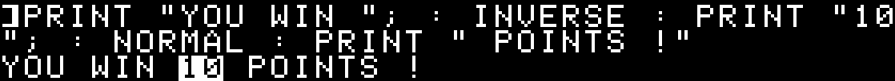
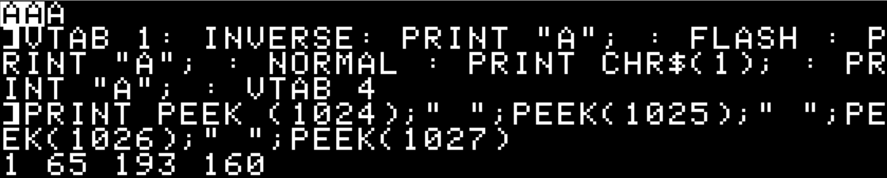
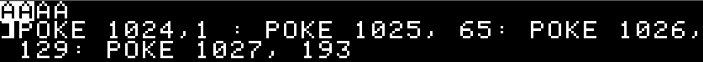
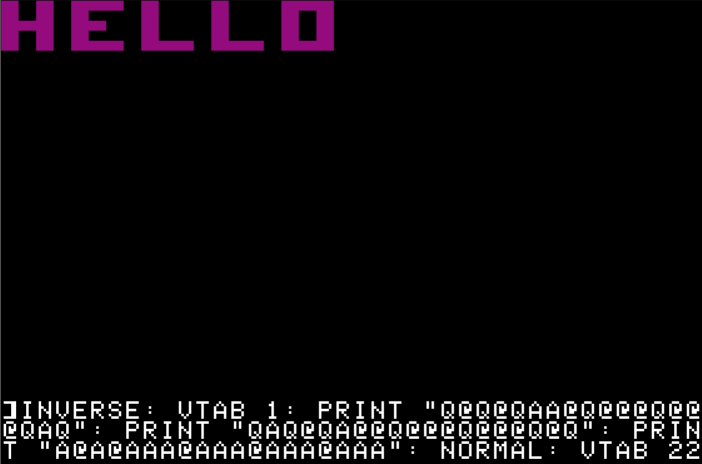

# STRANGER THINGS ABOUT YOUR APPLE II, part 3
An A2SE series about things you did not know about your Apple II or maybe simply forgot.

# Part 3: Inline Text Modes

In this article we're going to discover how you can
- integrate `FLASH`/`INVERSE`/`NORMAL` commands within strings and strings variables
- display `FLASH`/`INVERSE` characters in listings
- `PRINT` normally unprintable control-characters in order to plot brown and orange pixels on the lores screen (wtf ?)

## Text modes on the Apple II
This is old news: the Apple II support 3 kind of text displays: characters are written on screen either in `NORMAL` mode (white on black), `INVERSE` mode (black on white) or `FLASH` mode (alternating between `NORMAL` and `INVERSE` mode).

Three commands allow you to change the text mode. They are `NORMAL`, `INVERSE` and `FLASH`.

If you want your text to be printed in inverse, all you have to do is issue an `INVERSE` statement before a `PRINT`:
```basic
INVERSE: PRINT "YOU WIN 10 POINTS !"
```


If you don't issue a `NORMAL` command, then all the subsequent `PRINT`s will display text in `INVERSE`. The same goes for `FLASH`.

Now, if you want to mix `NORMAL`/`INVERSE`/`FLASH` modes in the same string, your only option is to issue several `PRINT`s and adjust the text mode accordingly in between.
```basic
PRINT "YOU WIN "; : INVERSE : PRINT "10"; : NORMAL : PRINT " POINTS !"
```


## Integrating text modes within strings
This is something that's possible on several 8-bit computers but not on the Apple II, except if you have a 80-column card. In this case, **and** if the card is active, you can use CTRL-O and CTRL-N to instruct the computer that the following characters are respectively in `INVERSE` or `NORMAL` modes. There's no CTRL code for the `FLASH` mode though, as the 80 column cannot display `FLASH` characters.

We are going to do exactly the same but without the need for a 80-column card and we will add a CTRL code for the `FLASH` mode too !

The way to do that is rather easy as all we have to do is redirect the character output routine of the Apple II to our own routine.

Fortunately, this redirection has been planned from day one in Woz' monitor. This is basically what allows you to print your listings and screens on a printer (and not on screen). This is also how DOS intercepts CTRL-D commands (you know like `PRINT CHR$(4);"CATALOG"` ) and how DOS and PRODOS commands are handled.

In `$FDED` is the monitor routine named `COUT`. Its role is to handle the output of characters on screen. But the first thing `COUT` does is give control to another, user-defined, routine, if any. By default (if there's no DOS/PRODOS), this routine is located in `$FDF0` (and is named `COUT1`), that is just 3 bytes after `$FDED` and it's in fact the next instruction after the one in `$FDED`.

We have this:
```Assembly
FDED: 6C 36 00		COUT	JMP (CSWL)	; jump to location referenced by $36-$37
FDF0: 48		COUT1	PHA		; normal monitor character output routine starts here
FDF1: ...
```
So, what we need to do is write in CSWL (zero page $36) and CSWH (zero page $37) the address where we want to handle the character output.

There, we check if the character that must be output is one of the CTRL characters that will set the `NORMAL`/`INVERSE`/`FLASH` mode, set the mode accordingly and return the control to `$FDF0`. That's for the theory.

But remember I also want to print normally unprintable control-characters.

## How Applesoft and the monitor work together.
When you type a character on the Apple II keyboard, the character that's been typed is retrievable in `$C000` (decimal `-16384` or `49152` ... that's why you do `K=PEEK(49152)` when you want to identify which key was pressed). You also know that this character is a byte, and that it corresponds to the ASCII code of the character **plus 128** because the hi-bit of the byte is set. This value, if the character is meant to be printed on screen, is sent to `COUT`.

Thus, `COUT` expects a byte with a value above 127. Let's see what happens with Applesoft.

There are not many routines in Applesoft that output characters. We have `PRINT`. We have `INPUT` (that internally uses `PRINT`). We have `LIST`. We have `TRACE`. We have `TAB()` and `SPC()`. We have error messages too and then we have here and there some routines that output a carriage-return character for various reasons. All these use `COUT`. Thus the first thing that Applesoft does is add 128 to the ASCII value of the character that must be displayed (more precisely, Applesoft applies an ORA-mask on the byte value, forcing the hi-bit to turn on). 

Now with a byte value above 127, Applesoft then checks if the character is a "control-character", that is a character with an ASCII value below 32. But since the byte value is now above 127, it checks if the value is below 160 (=128+32). If it's NOT a control-character, then Applesoft checks if the `FLASH` mode is on. If it is, then it turns on the 6th bit of the byte (equivalent to add 32), and our byte value is now above 191.

Then the byte is sent to `COUT`.

So, `COUT` has a value which is either in
- range 128 to 159 if a control character is to be output
- range 160 to 255 if a `NORMAL` or `INVERSE` character is to be output
- range 192 to 255 if a `FLASH` character is to be output

The first thing that `COUT` does is modify the byte received:
- if `NORMAL` mode is set, the value is not modified. The byte is still **between 128 and 255**
- if `INVERSE` mode is set, bits 6 and 7 of the value are set to 0, which is equivalent to 
	- subtract 192 if the byte is above 191, or 
	- subtract 128 if the byte is between 128 and 191. The byte is now **between 0 and 63**.
- if `FLASH` mode is set, bit 7 is set to 0, equivalent to subtract 128. The byte is now **between 64 and 127**.
- if it's a control character, the value is not modified regardless of the current text mode

So we have now 4 possibilities:
- Values from 0 to 63 for `INVERSE` output
- Values from 64 to 127 for `FLASH` output
- Values from 128 to 159 for control characters
- Values from 160 to 255 for `NORMAL` output 

`INVERSE`, `FLASH` and `NORMAL` characters are output on screen accordingly while control-characters are handled separately. For a standard Apple II, only CTRL-G (bell), CTRL-M (return), CTRL-H (backspace or left-arrow) and CTRL-J (line feed or down-arrow) and handled. The others are simply ignored.

You can observe the result of each of the 4 possibilities mentioned above. Type
```basic
TEXT: HOME 
VTAB 1: INVERSE: PRINT "A"; : FLASH : PRINT "A"; : NORMAL : PRINT CHR$(1); : PRINT "A"; : VTAB 4
```
As you can see, the `PRINT CTRL-A` (or more exactly `PRINT CHR$(1)`) did not output anything because `COUT` ignores control-characters.
Now type
```basic
PRINT PEEK (1024);" ";PEEK(1025);" ";PEEK(1026);" ";PEEK(1027)
```
These are the 4 values of the first 4 characters on the top of the screen. The 1 is A in `INVERSE`, the 65 is A in `FLASH`, the 193 is A in `NORMAL` and the 160 is just the space character in `NORMAL` in the 4th position. The control-character was not printed.



Now let us do the same but without `PRINT`:
```basic
TEXT: HOME
POKE 1024,1 : POKE 1025, 65: POKE 1026, 129: POKE 1027, 193
```



Well ! It looks like we can store values of 128 to 159 on the screen memory even though we cannot PRINT those control-characters.

## Why print control-characters ?
Let's admit it, at first sight, there's absolutely no interest in printing control-characters. After all, these characters are designed to be invisible: they're used in communications protocols or to move the cursor, etc. What's more they just look like normal characters when you `POKE` them in screen memory.

Well, there's one minor interest though. The text area memory is in $400-$7FF. And this area is shared with the lo-res display. It means we can use `PRINT` to `PLOT` on the lores screen. `PRINT`ing one character actually draws two contiguous vertical lores pixels.

For instance, type the following:
```basic
GR
INVERSE: VTAB 1: PRINT "Q@Q@QAA@Q@@@Q@@@QAQ": PRINT "QAQ@QA@@Q@@@Q@@@Q@Q": PRINT "A@A@AAA@AAA@AAA@AAA": NORMAL: VTAB 22
```



You've just drawn the word "HELLO" the fastest possible way with Applesoft only. 

The problem now is that to `PRINT`/draw all possible combinations of colors you need to be able to `PRINT` all 255 possible values of bytes, including those between 128 to 159, that is the control-characters. 

As `PRINT` is super-fast compared to `PLOT` (or `HLIN` and `VLIN`), this could be used to display sprites on the lores screen faster than ever with Applesoft.

And since what we want to do is use combinations of CTRL-characters to change the text mode **within** strings, we could draw any shape and store the `INVERSE`/`FLASH`/`NORMAL`/`SPECIAL` statements within the string itself !

## The code explained
The routine will be simple and short, so we can store it in $300. But if you want to store it elsewhere, you can as it's completely relocatable.

The first thing we want to do is initialize CSWL/CSWH (and thus activate our routine). To do that we can begin in $300 with a simple init routine that needs to be called at the start of your Applesoft program (or at least before you want to take advantage of the new feature).

We also want to initialize a flag stating that the "Peculiar mode" is not set yet. The "Peculiar mode" is that new mode where we allow to print control-characters. I decided that this flag would be stored in zero page $34. This memory location is normally used by the monitor (it is known as `YSAV`) to store temp data but I estimated that there would be no interest in being in the monitor AND want to print control-characters on the lores screen. As this is the only zero page location that I need, I wanted to avoid any of the usual "free" zero pages locations to make sure I don't interfere with possibly other programs that might use these "free" locations.

So the code begins with:

```Assembly
300: A9 03	INIT		LDA #>START				
302: 85 37			STA CSWH
304: A9 0D			LDA #<START
306: 85 36			STA CSWL
308: A9 00			LDA #$00				; SET PECULIAR_MODE FLAG TO ZERO
30A: 85 34			STA PECULIAR_MODE
30C: 60				RTS
30D		START
```
Nothing too complicated so far, I think. All we'd have to do is `CALL 768` to initialize the new feature and then any character to be displayed would be handled by our routine in `$30D`.

The important rule is that every register we use must have its value restored when leaving our routine. In theory, when entering our routine `A` holds the character to print (with the hi-bit set), `X` might be an offset in the input buffer and `Y` is either an offset to a memory location or the index of a character in the string to print. Depending on who's the caller (Applesoft, the monitor, another program ?) and the reason why a character is being displayed (`PRINT`, `INPUT`, `LIST`, monitor listing, something else ?) the values in `X` and `Y` may vary.

So the first thing we will do is save the values of `A` and `X`. Why these two ? Because we are going to use three Applesoft ROM routines (`NORMAL` in `$F273`, `INVERSE` in `$F277` and `FLASH` in `$F280`) that will modify `A` and `X`.

We will save `A` on the stack and `X` in a zero page location named `YSAV1` (in `$35`). This location is used by `COUT1` to save the value in `Y` and restore it when leaving. It's not used elsewhere meaning we can use it for the same purpose (except we're going to save `X`) until we actually call `COUT1`.

Then we are going to verify the value in `A`:
- if it's CTRL-P then we set the "Peculiar mode" flag on (by writing $FF in it, the important thing being that the hi-bit is set), restore `A` and `X` and call `COUT1`
- if it's CTRL-F then we call the `FLASH` routine in `$F280`, this modifies `A` and `X` registers (`X` being now $40, the value of the FLASH-mask), we clear `X` and use `X` to reset the "Peculiar mode" flag, we restore `A` and `X` and call `COUT1`
- if it's CTRL-O then we call the `INVERSE` routine in `$F277`, this again modifies `A` and `X` but `X` is now zero. We use `X` to reset the "Peculiar mode" flag, we restore `A` and `X` and call `COUT1`
- if it's CTRL-N then we call the `NORMAL` routine in  `$F273`. Just like the `INVERSE` routine, this modifies `A` and `X` and `X` is now zero. Again, we use `X` to reset the "Peculiar mode" flag, we restore `A` and `X` and call `COUT1`
- if it's any other character, then we check the "Peculiar mode" flag. If it's off, we call `COUT1`. If it's on then we need to modify the value of `A` so it fits within $80-$9F. More about that in a moment.

Here's the code so far:
```Assembly
30D: 86 35	START		STX YSAV1		; SAVE X IN YSAV1
30F: 48				PHA			; SAVE A ON STACK

310: C9 90	CHK_CTRL_P	CMP #$90		; IS A = CTRL-P ? (ASCII $10 + $80)
312: D0 04			BNE CHK_CTRL_F		; NO, CHECK CTRL-F
314: A2 FF			LDX #$FF		; YES, PREPARE THE VALUE TO SET PECULIAR MODE ON
316: D0 1B			BNE OUT			; THIS BRANCHES ALWAYS BECAUSE X IS NOT ZERO

318: C9 86	CHK_CTRL_F	CMP #$86		; IS A = CTRL-F ? (ASCII $06 + $80)
31A: D0 07			BNE CHK_CTRL_O		; NO, CHECK CTRL-O
31C: 20 80 F2			JSR FLASH		; SET FLASH MODE, RETURNS WITH X=$40
31F: A2 00			LDX #$00		; SET X=0, PREPARE VALUE FOR PECULIAR MODE
321: F0 10			BEQ OUT			; ALWAYS TAKEN

323: C9 8F	CHK_CTRL_O	CMP #$8F		; IS A = CTRL-O ? (ASCII $0F + $80)
325: D0 05			BNE CHK_CTRL_N		; NO, CHECK CTRL-N
327: 20 77 F2			JSR INVERSE		; SET INVERSE MODE, RETURNS WITH X=0
32A: F0 07			BEQ OUT			; ALWAYS TAKEN

32C: C9 8E	CHK_CTRL_N	CMP #$8E		; IS A = CTRL-N ? (ASCII $0E + $80)
32E: D0 0B			BNE CHK_P_MODE		; NO, CHECK PECULIAR MODE
330: 20 73 F2			JSR NORMAL		; SET NORMAL MODE, RETURNS WITH X=0

333: 86 34	OUT		STX PECULIAR_MODE	; SET PECULIAR MODE WITH VALUE IN X
335: 68		OUT0		PLA			; RESTORE A
336: A6 35	OUT1		LDX YSAV1		; RESTORE X
337: 4C F0 FD			JMP COUT1		; DISPLAY THE CHARACTER IF POSSIBLE

33B: A6 34	CHK_P_MODE	LDX PECULIAR_MODE	; LOAD PECULIAR MODE FLAG IN X
33D: 10 F6			BPL OUT0		; IF HIBIT NOT SET, THEN NOT IN P-MODE, OUTPUT THE CHARACTER

33F:		P_MODE
```

Now the only thing left to do is handle the "Peculiar mode". Because this mode is meant to be used with `PRINT` and `PRINT` only (while showing the lores screen), we need to check first if we're busy `PRINT`ing text or if we're doing something else like `LIST` for instance. If the command was `LIST`, we don't want to display weird characters. For example all the space characters (value 32) would be replaced with @ (value zero).

The way I've found to detect if we're `PRINT`ing something is to check the stack for a return address that would go back somewhere in Applesoft `PRINT` routine. That somewhere is `$DB4C` (or more exactly `$DB4B` as it would be stored on the stack). This is the return address after a call to a subroutine named `OUTDO` in `$DB5C` that actually calls `COUT` in `$DB64`.

So, if our routine was indirectly called from Applesoft, the stack (from the last stacked value) looks like this: `66 DB 4B DB`. 

`$DB66`(+1) is the return address to `OUTDO`, while `$DB4B`(+1) is the return address from the `PRINT` command. The interesting byte in the stack is the 3rd. We can assume this byte will **never** be `$4B` if our routine comes from anything else but `PRINT`. So, we just need to check the value of the 3rd byte. Well, in fact the **4th** byte, because our own routine adds the value of `A` to the stack.

So if we were not `PRINT`ing, we simply ignore the Peculiar mode and call `COUT1`. But if we're `PRINT`ing we do a bit more work.

First we check if the character we need to print is a CTRL character. If it is, again, we just send it to `COUT1`. But if it's not we need to modify the character to print so that it goes into the $80-$9F range. In order to do that, we simply clear the 5th and 6th bit of the character. Then we call a routine that is part of `COUT1` but that is called usually when then character is **not** in the $80-$9F range. This routine is named `STORADV` (in `$FBF0`) and is responsible for writing the value of `A` at the appropriate location in the screen memory area and update the cursor position and scroll the text window if needed.

The small setback is that this routine uses `Y`. So far we have not used `Y`. We haven't even saved `Y`. Thus we need to save `Y` before calling `STORADV`, then restore it, restore `A` and `X` too and return to the caller. This is a trivial case of juggling with the available registers.

Here goes:
```Assembly
33F: BA		P_MODE		TSX			; GET STACK POINTER TO X
340: BD 05 01			LDA STACK+5,X		; GET MSB OF THE RETURN ADDRESS
343: C9 DB			CMP #$DB		; IS IT FROM PRINT IN $DB49 ?
345: D0 EC			BNE OUT0		; NO, LET'S CALL COUT1 THEN

347: 68				PLA			; GET CHARACTER VALUE BACK FROM STACK
348: C9 A0			CMP #$A0		; IS IT A CONTROL CHAR (<160)
34A: 90 E8			BCC OUT1		; YES, LET'S CALL COUT1 THEN

34C: AA				TAX			; SAVE CHAR IN X
34D: 98				TYA			; SAVE Y IN A
34E: 48				PHA			; STORE VALUE OF Y ON STACK
34F: 8A				TXA			; GET BACK CHAR FROM X
350: 29 9F			AND #$9F		; CLEAR BITS 5 & 6, RANGE IS NOW $80-$9F
352: 20 F0 FB			JSR STORADV		; FORCE DISPLAY OF CHAR
355: 68				PLA			; RESTORE VALUE OF Y FROM STACK
356: A8				TAY			; BACK TO Y
357: 8A				TXA			; RESTORE A FROM X
358: A6 35			LDX YSAV1		; RESTORE X FROM YSAV1
35A: 60				RTS			; RETURN TO CALLER
```

And here's the full code:
```Assembly
300: A9 03 85 37 A9 0D 85 36
308: A9 00 85 34 60 86 35 48
310: C9 90 D0 04 A2 FF D0 1B
318: C9 86 D0 07 20 80 F2 A2
320: 00 F0 10 C9 8F D0 05 20
328: 77 F2 F0 07 C9 8E D0 0B
330: 20 73 F2 86 34 68 A6 35
338: 4C F0 FD A6 34 10 F6 BA 
340: BD 04 01 C9 4B D0 EE 68
348: C9 A0 90 EA AA 98 48 8A
350: 29 9F 20 F0 FB 68 A8 8A
358: A6 35 60
```
## Disabling the OS
In order to activate the feature, a simple `CALL 768` is enough. But before anything, you must disable DOS (or PRODOS).

What's that ? DOS/ProDOS use the CSW output redirection vector in order to handle their own features. Without going into details, this is (among other features) how DOS/ProDOS intercepts CTRL-D within `PRINT` commands in order to manipulate files on disk from an Applesoft program.

DOS/ProDOS makes sure that CSW will redirect output to their routines. Because we are using redirection we need to take control over DOS/ProDOS. But also, you must know that PRINTing a character on the screen with DOS/ProDOS active is twice the time it takes if they were not active/present. Disabling the OS means doubling the output speed.

To prevent that, we need to disconnect DOS/ProDOS. And when we need DOS/ProDOS back we need to be able to reconnect DOS/ProDOS.

DOS can be disconnected with a `CALL 40672` and reconnected with `CALL 43089`.

But there's a more universal method that is common to both DOS and ProDOS. It's as easy as POKEing values in CSW and KSW. But this has to be done in one shot in four consecutive `POKE`s within a program.
`POKE 54,240: POKE 55,253: POKE 56,27: POKE 57,253` unhooks DOS/ProDOS and restores CSW/KSW to their original values. In ProDOS, you also need to issue a NOTRACE command (because ProDOS uses TRACE to possibly interfere with EVERY Applesoft command).

To restore DOS/ProDOS, as they use different CSW/KSW values, it's best to simply do a `CALL 976` (`$3D0`). or a `CALL 1002` (`$3EA`).

## Example code
To conclude, you'll find a [DSK image](st3_inline_text_modes.dsk) with a short animation example demonstrating the possibilities of this new feature.

There's also a video of the program running: [meeting_the_beadmaster.mkv](meeting_the_beadmaster.mkv)

The [Applesoft code](meeting_the_beadmaster.bas) is also available. The animation happen in lines 0-999 while the sprites are built in lines 1000-3000. The sprites are long string variables that include all the characters and control-characters needed. To build these I used an Excel spreadsheet as editor (as it was easier). Maybe one day I'll share it. But now is not the time.

Enjoy !
