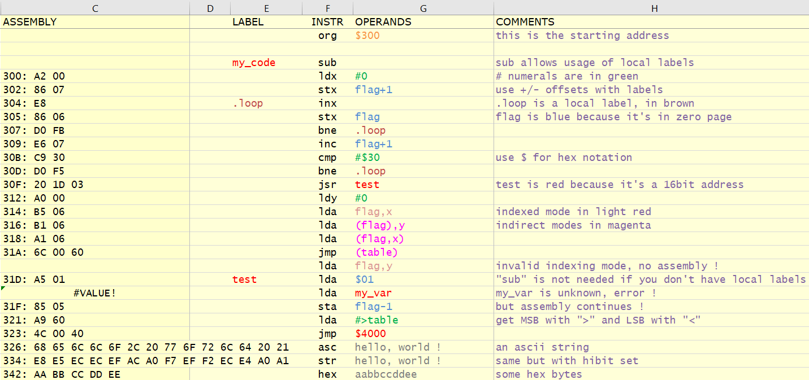

# 6502 SpASM (6502 Spreadsheet Assembler and Linker) v1.2.1

This is a ~~proof-of-concept~~ full-featured 6502 assembler with linker in a spreadsheet (works with Excel, Libre Office, etc.).

If you're using Libre Office, you need Libre Office v7.1.x or later if you want to use the linker.

The 6502_SpASM-v.x.y.xlsx file is the latest release. Instructions included in the spreadsheet.

The 6502_SpASM-v.x.y-example.xlsx file contains an example with different modules linked. Possibly in an older version.

## Features
- all the 6502 instructions plus a couple of pseudo-instructions
- all addressing modes
- global and local labels
- EQUs to declare constants
- use of +/- offsets with constants/labels/numeric values
- use of "#" to reference values
- decimal notation by default (0-65535)
- use of "$" for hexadecimal notation (2 bytes max)
- use of "%" for binary notation (16 bits max)
- use of ">" and "<" to point to MSB and LSB (2 bytes only) and "#>" and "#<" to reference MSB/LSB as values
- display cycle count
- ORG within code to define different starting addresses for modules
- HEX pseudo-instruction to define HEX data and HEX fills.
- ASC/STR pseudo-instructions to define text constants (with ASC, hi-bit is unset, while with STR, it is)
- DCI/ADI/STI support to alternate the hibit of the last char
- INV/FLS/BLK support for INVERSE/FLASH characters
- syntax highlighting
- linking of object modules (sheets) in the same workbook
- global labels across the workbook
- negative values are supported for decimal notation
- error checking (highlighted in brown)
- supports commented code lines

## Revisions
### v1.2.1 (Feb 18, 2021)
- now supports commented code lines 
- added ADI/DCI
- added SDI
- added INV/FLS/BLK
- added "HEX bytes,n" support
- added "HEX one_byte," support
- moved Example in another workbook that will get updates only if needed

### v1.2.0 (Feb 15, 2021)
- added linker
- linker requires Libre Office v7.1.x or above (or MS Excel)
- added globals labels page
- removed more external links
- little fixes here and there
- removed Wagner's code samples
- can reference ASCII values with ' or "
- errors highlighting
- added numerous examples in instructions_code sheet (used as a test sheet)

### v1.1.2 (Feb 8, 2021)
- fixed instructions because columns were shifted with latest release
- added syntax highlighting for SUBs
- deleted Excel external link

### v1.1.1 (Feb 8, 2021)
- fixed more bytes count for some opcodes
- rewrote the byte count detection in order to avoid possible circular references
- column D is now colored as comments, it's meant to be used as full-line comments
- new official name "SpASM" !

### v1.1 (Feb 6, 2021)
- fixed bytes needed for some opcodes
- added cycles display
- added support of ORG in the middle of the code
- added support for #label and #<label and #>label for HEX opcode

### v1.0.1 (Jan 31, 2021)
- fixed zp jmp/jsr
- fixed ld_ #> and ld_ #<

### v1.0 (Jan 31, 2021)
- initial release

## Licence
You may freely use, copy (etc) this spreadsheet for your own creations and you may also redistribute it on any kind of media as long as the "instructions" sheet is included and not modified.
If you mention this file or distribute it elsewhere, please send me a message. I'm on Facebook's "Apple II Software Enthusiasts" and "Apple II Enthusiasts" groups, among others.
