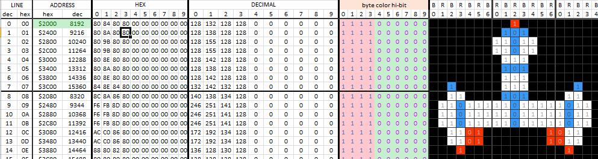

# Bitmap Creator for Apple ]\[ hires sprites/bitmaps

An [Excel Spreadsheet](https://github.com/tilleul/apple2/tree/master/tools/bitmap%20editor/src) to virtually create and render Apple ]\[ bitmaps/sprites. Works too with Calc in Libre Office/Open Office.

Fill in Apple ]\[ hires screen bits on a spreadsheet to create reusable bitmaps and sprites for your Apple ]\[ software development. 

Use the copy/paste features of spreadsheet to easily create pre-shifted shapes. 

The spreadsheet renders the bitmap as a real Apple ]\[, computes all the bytes values (so you can copy/paste them in your program) and even generates `POKE`s commands to type in Applesoft so you can see how it renders in your favourite Apple ]\[ emulator.

Instructions are included in the spreadsheet.

Also, an [article](apple2_hires.md) about Apple ]\[ hires. Including some interesting 6502 tricks (WIP).
