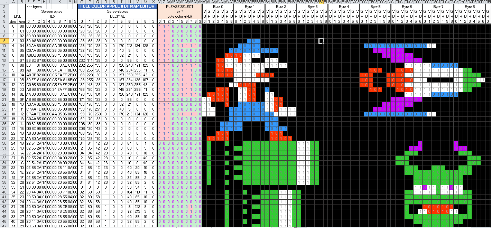
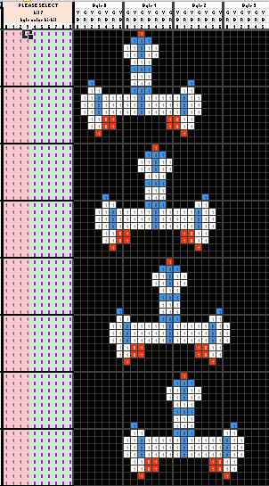

# Bitmap Creator for Apple ]\[ hires sprites/bitmaps

</img>
An [Excel Spreadsheet](https://github.com/tilleul/apple2/tree/master/tools/bitmap%20editor/src) to virtually create and render Apple ]\[ bitmaps/sprites. 

Works with MS Excel, Libre Office/Open Office Calc.

Fill in Apple ]\[ hires screen bits on a spreadsheet to create reusable bitmaps and sprites for your Apple ]\[ software development. 

Use the copy/paste features of spreadsheet to easily create pre-shifted shapes. 

The spreadsheet 
* renders the bitmap as a real Apple ]\[ (or more precisely like an emulator), 
* computes all the bytes values (so you can copy/paste them in your program)
* generates `POKE` commands to type in Applesoft so you can see how it renders in your favourite Apple ]\[ emulator.

Instructions are included in the spreadsheet.

LICENCE
You may freely use, copy (etc) this spreadsheet for your own creations and you may also redistribute it on any kind of media as long as the "instructions" sheet is included and not modified.
If you mention this file or distribute it elsewhere, please send me a message. I'm on Facebook's "Apple II Software Enthusiasts" and "Apple II Enthusiasts" groups, among others.
