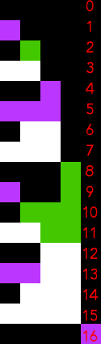
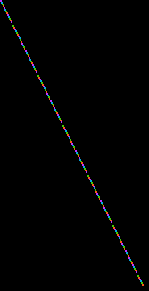

# Revisiting Apple ]\[ hires
## Summary
* [Introduction](#introduction)
* [Structure of the hires screen in RAM](#structure-of-the-hires-screen-in-ram)
* [Summary table of addresses in RAM](#summary-table-of-addresses-in-ram)
* [Taking advantage of the hires structure](#taking-advantage-of-the-hires-structure)
	* [Use case #1: displaying tiles](#use-case-1-displaying-tiles)
	* [Use case #2: clearing the screen](#use-case-2-clearing-the-screen)
	* [Use case #3: side-scrolling](#use-case-3-side-scrolling)
* [Apple \]\[ hires colors: some possibilities, lots of limitations](apple-hires-colors-some-possibilities-lots-of-limitations]


## Introduction
A lot has been said and written on the Apple ]\[ hires screens. How colors work, how it's organized in RAM, how to animate sprites, how to clear the screen faster than the HGR/HGR2 Applesoft commands, how to draw faster lines than HPLOT, etc.

This article does not have the pretention to uncover anything new regarding hires pages: if you know how to program your Apple ]\[ then most of the information here will be old news to you. Nonetheless there might be a trick or two that I learned the hard way that still might be useful to you. 

I've written this as if you didn't know much about hires on Apple ]\[ except maybe a few Applesoft commands like `HGR/HGR2`, `HCOLOR` and `HPLOT`. Maybe even `DRAW/XDRAW` ... and yet you don't know how it works behind all this.

So this article will first cover the basics: structure of the hires pages in RAM, pixels and colors (even in those sections you might find some rare info) and then will dive into specific techniques and tools I've encountered or developed.

I'll try to make you understand how it works by using Applesoft most of the time, so I expect you know mostly how to program in Applesoft. I won't explain the Applesoft code much except using some `REM`s in the code. 

Some parts of this article will feature 6502 code. If you're not comfortable with 6502, don't worry, just skip the section.


## Structure of the hires screen in RAM
The Apple ]\[ has 2 hires pages. One in $2000-$3FFF. The second one in $4000-$5FFF. Each page is thus 8192 bytes long.

The dimensions of one hires page are 40 bytes wide and 192 lines high. 40x192 = 7680 bytes. 512 bytes are "missing" and in fact not used/displayed.

The hires screen is divided in 3 zones of 64 lines. Let's call it zones A.
Each section is then divided in 8 sub-sections of 8 lines. Let's call these zones B.
Every B zone is itself divided in 8 sub-sub-sections representing the lines themselves. These are zones C.

To better understand this division, it's easier to POKE bytes into RAM and see what happens.

A `POKE 8192,255`will plot 7 pixels on the top left corner of the hires screen (page 1). Poking the next memory address (8193), will plot 7 more pixels on line 0 of the hires screen.

So to draw the entire line 0 we could `RUN` this code

    10 HGR
    20 FOR I = 0 TO 39: POKE 8192+I, 255: NEXT


8192 + 40 = 8232 ($2028) is the next byte in memory. But`POKE 8232,255` will not plot 7 pixels on line 1 but on line 64 !

If we slightly modify the above code to POKE the first 3 lines as stored in memory, we have

    10 HGR
    20 P = 8192: REM $2000
    30 FOR A = 0 TO 2: REM 3 A-ZONES
    40 FOR I = 0 TO 39: REM 40 BYTES PER LINE
    50 POKE P, 255
    60 P = P + 1
    70 NEXT I,A
    80 PRINT P

The result is this


We have drawn line 0, line 64 and line 128 ! These 3 lines represent the first line of each A-zone.

Now the next address to `POKE` seems to be 8312 ($2078 in hex -- the resulting value in our variable `P`).

But if we do `POKE 8312, 255` we don't see any change on the screen ! This is because we have reached one the hires screen holes !

In fact, all lines between 128 and 191 in RAM have 8 unused bytes at their end. Those 8x64 lines represent 512 bytes. Those are the missing bytes in first computation.

Now that we now that, we could slightly modify the above code so that after having drawn 3 lines, we add 8 to `A`so that it points to the next line location in memory. Let's do it and plot 3 times 3 lines.


    10 HGR
    20 P = 8192: REM $2000
    30 FOR B = 0 TO 2: REM FOR NOW JUST DRAW INTO 3 B-ZONES
    40 FOR A = 0 TO 2: REM 3 A-ZONES
    50 FOR I = 0 TO 39: REM 40 BYTES PER LINE
    60 POKE P, 255
    70 P = P + 1
    80 NEXT I,A
    90 P = P + 8
    100 NEXT B
    110 PRINT P

We end up with


As you watch how the lines are filled, you better understand the hires screen structure: 
* the first 3 lines of 40 bytes delimit the three A-zones and represent lines 0, 64 and 128 of the screen. Incidentally, these are too the first B-zones of each A-zone.
* then 8 bytes are wasted
* the next 3 lines of 40 bytes represent line 8 of each of the A-zones and the 2nd B-zone of each A-zone (that is the base line of each A-zone + 8, so we have lines 0+8, 64+8 and 128+8)
* then 8 bytes are wasted
* the next 3 lines of 40 bytes represent line 16 of each of the A-zones and the 3rd B-zone in each A-zone
* then 8 bytes are wasted
* This continues until we've arrived at line 56 relative to each A-zone, which is also the 8th B-zone for each A-zone. That is line 0+56=56, line 64+56=120 and line 128+56=184.

The following code will do it

    10 HGR
    20 P = 8192: REM $2000
    30 FOR B = 0 TO 7: REM 8 B-ZONES IN EACH A-ZONE
    40 FOR A = 0 TO 2: REM 3 A-ZONES
    50 FOR I = 0 TO 39: REM 40 BYTES PER LINE
    60 POKE P, 255
    70 P = P + 1
    80 NEXT I,A
    90 P = P + 8
    100 NEXT B
    110 PRINT A


So what happens next ? Well, a `POKE 9216,255` will show you that you're plotting on line 1 ! And once line 1 has been filled, you'll plot on line 65 ! And then on line 129 ! Then back to first section of 64-lines but on line 8+1=9, then on line 16+1=17, etc.

    10 HGR
    20 P = 8192: REM $2000
    30 FOR C = 0 TO 7: REM 8 C-ZONES IN EACH B-ZONE
    40 FOR B = 0 TO 7: REM 8 B-ZONES IN EACH A-ZONE
    50 FOR A = 0 TO 2: REM 3 A-ZONES
    60 FOR I = 0 TO 39: REM 40 BYTES PER LINE
    70 POKE P, 255
    80 P = P + 1
    90 NEXT I,A
    100 P = P + 8
    110 NEXT B,C
    120 PRINT P

If you run the above code, your screen will be filled and A will point to 16384 (or $4000) which is the start of page 2.

To sum it up, the logical structure of the line numbers in RAM is as follows:

 1. There are 3 sections of 64 lines beginning at lines 0, 64 and 128. The baseline of the A-zones.
 2. The baseline for the C-zones is set to zero
 3. The baseline for the B-zones is set to zero
 4. The baseline for the A-zone is set to zero
 5. RAM holds the line = (A-zone baseline) + (B-zone baseline) + (C-zone baseline)
 6. Baseline for the A-zone is incremented by 64
 7. Back to step 5, two more times
 8. Then 8 bytes are wasted
 9. B-zone baseline is incremented by 8
 10. Back to step 4, seven more times
 11. C-zone baseline is incremented by 1
 12. Back to step 3, seven more times

In code that would be

    10 HGR: P = 8192
    20 C = 0 : NC = 0 : REM C-ZONE BASELINE AND COUNTER
    30 B = 0 : NB = 0 : REM B-ZONE BASELINE AND COUNTER
    40 A = 0 : NA = 0 : REM A-ZONE BASELINE AND COUNTER
    50 HPLOT 0, A + B + C TO 279, A + B + C: REM DRAW A WHOLE LINE
    60 PRINT A + B + C;": ";P" ";: A = A + 64: P = P + 40: REM INCREMENT A-ZONE BASELINE AND POINTER P
    70 NA = NA + 1 : IF NA < 3 THEN GOTO 50: REM THERE ARE 3 A-ZONES
    80 P = P + 8: REM HERE 8 BYTES ARE NOT USED
    90 B = B + 8: REM INCREMENT B-ZONE BASELINE
    100 NB = NB + 1: IF NB<8 THEN GOTO 40: REM 8 B-ZONES PER A-ZONE
    110 C = C + 1
    120 NC = NC + 1: IF NC<8 THEN GOTO 30: REM 8 C-ZONES PER B-ZONE

Notice how the HPLOTs draw the lines in the same order as the `POKE`s in the previous programs.

The starting address of a line Y in hires page 1 is found using the following formula:

    A = INT(Y/64): REM A-ZONE
    B = INT( (Y - 64 * A) / 8): REM B-ZONE
    C = INT(Y - 64 * A - 8 * B): REM C-ZONE
    P = 8192 + A * 40 + B * 128 + C * 1024: REM STARTING ADDRESS IN RAM

## Summary table of addresses in RAM
Here are all the addresses for hires page 1. Simply add `#$40` to all MSB for page 2.

|<sub>Line</sub>|<sub> Start  </sub>|<sub> End </sub>|<sub> Line </sub>|<sub> Start  </sub>|<sub> End </sub>|<sub> Line </sub>|<sub> Start  </sub>|<sub> End </sub>|<sub> Line </sub>|<sub> Start  </sub>|<sub> End </sub>|<sub>Line </sub>|<sub> Start  </sub>|<sub> End </sub>|<sub> Line </sub>|<sub> Start  </sub>|<sub> End </sub>|<sub>Line </sub>|<sub> Start  </sub>|<sub> End </sub>|<sub> Line </sub>|<sub> Start  </sub>|<sub> End </sub>|
|--|--|--|--|--|--|--|--|--|--|--|--|--|--|--|--|--|--|--|--|--|--|--|--|
| <sub>**0**</sub> | <sub>$2000</sub> | <sub>$2027</sub> | <sub>**1**</sub> | <sub>$2400</sub> | <sub>$2427</sub> | <sub>**2**</sub> | <sub>$2800</sub> | <sub>$2827</sub> | <sub>**3**</sub> | <sub>$2C00</sub> | <sub>$2C27</sub> | <sub>**4**</sub> | <sub>$3000</sub> | <sub>$3027</sub> | <sub>**5**</sub> | <sub>$3400</sub> | <sub>$3427</sub> | <sub>**6**</sub> | <sub>$3800</sub> | <sub>$3827</sub> | <sub>**7**</sub> | <sub>$3C00</sub> | <sub>$3C27</sub> |
| <sub>**64**</sub> | <sub>$2028</sub> | <sub>$204F</sub> | <sub>**65**</sub> | <sub>$2428</sub> | <sub>$244F</sub> | <sub>**66**</sub> | <sub>$2828</sub> | <sub>$284F</sub> | <sub>**67**</sub> | <sub>$2C28</sub> | <sub>$2C4F</sub> | <sub>**68**</sub> | <sub>$3028</sub> | <sub>$304F</sub> | <sub>**69**</sub> | <sub>$3428</sub> | <sub>$344F</sub> | <sub>**70**</sub> | <sub>$3828</sub> | <sub>$384F</sub> | <sub>**71**</sub> | <sub>$3C28</sub> | <sub>$3C4F</sub> |
| <sub>**128**</sub> | <sub>$2050</sub> | <sub>$2077</sub> | <sub>**129**</sub> | <sub>$2450</sub> | <sub>$2477</sub> | <sub>**130**</sub> | <sub>$2850</sub> | <sub>$2877</sub> | <sub>**131**</sub> | <sub>$2C50</sub> | <sub>$2C77</sub> | <sub>**132**</sub> | <sub>$3050</sub> | <sub>$3077</sub> | <sub>**133**</sub> | <sub>$3450</sub> | <sub>$3477</sub> | <sub>**134**</sub> | <sub>$3850</sub> | <sub>$3877</sub> | <sub>**135**</sub> | <sub>$3C50</sub> | <sub>$3C77</sub> |
| <sub>**wasted**</sub> | <sub>$2078</sub> | <sub>$207F</sub> | <sub>**wasted**</sub> | <sub>$2478</sub> | <sub>$247F</sub> | <sub>**wasted**</sub> | <sub>$2878</sub> | <sub>$287F</sub> | <sub>**wasted**</sub> | <sub>$2C78</sub> | <sub>$2C7F</sub> | <sub>**wasted**</sub> | <sub>$3078</sub> | <sub>$307F</sub> | <sub>**wasted**</sub> | <sub>$3478</sub> | <sub>$347F</sub> | <sub>**wasted**</sub> | <sub>$3878</sub> | <sub>$387F</sub> | <sub>**wasted**</sub> | <sub>$3C78</sub> | <sub>$3C7F</sub> |
| <sub>**8**</sub> | <sub>$2080</sub> | <sub>$20A7</sub> | <sub>**9**</sub> | <sub>$2480</sub> | <sub>$24A7</sub> | <sub>**10**</sub> | <sub>$2880</sub> | <sub>$28A7</sub> | <sub>**11**</sub> | <sub>$2C80</sub> | <sub>$2CA7</sub> | <sub>**12**</sub> | <sub>$3080</sub> | <sub>$30A7</sub> | <sub>**13**</sub> | <sub>$3480</sub> | <sub>$34A7</sub> | <sub>**14**</sub> | <sub>$3880</sub> | <sub>$38A7</sub> | <sub>**15**</sub> | <sub>$3C80</sub> | <sub>$3CA7</sub> |
| <sub>**72**</sub> | <sub>$20A8</sub> | <sub>$20CF</sub> | <sub>**73**</sub> | <sub>$24A8</sub> | <sub>$24CF</sub> | <sub>**74**</sub> | <sub>$28A8</sub> | <sub>$28CF</sub> | <sub>**75**</sub> | <sub>$2CA8</sub> | <sub>$2CCF</sub> | <sub>**76**</sub> | <sub>$30A8</sub> | <sub>$30CF</sub> | <sub>**77**</sub> | <sub>$34A8</sub> | <sub>$34CF</sub> | <sub>**78**</sub> | <sub>$38A8</sub> | <sub>$38CF</sub> | <sub>**79**</sub> | <sub>$3CA8</sub> | <sub>$3CCF</sub> |
| <sub>**136**</sub> | <sub>$20D0</sub> | <sub>$20F7</sub> | <sub>**137**</sub> | <sub>$24D0</sub> | <sub>$24F7</sub> | <sub>**138**</sub> | <sub>$28D0</sub> | <sub>$28F7</sub> | <sub>**139**</sub> | <sub>$2CD0</sub> | <sub>$2CF7</sub> | <sub>**140**</sub> | <sub>$30D0</sub> | <sub>$30F7</sub> | <sub>**141**</sub> | <sub>$34D0</sub> | <sub>$34F7</sub> | <sub>**142**</sub> | <sub>$38D0</sub> | <sub>$38F7</sub> | <sub>**143**</sub> | <sub>$3CD0</sub> | <sub>$3CF7</sub> |
| <sub>**wasted**</sub> | <sub>$20F8</sub> | <sub>$20FF</sub> | <sub>**wasted**</sub> | <sub>$24F8</sub> | <sub>$24FF</sub> | <sub>**wasted**</sub> | <sub>$28F8</sub> | <sub>$28FF</sub> | <sub>**wasted**</sub> | <sub>$2CF8</sub> | <sub>$2CFF</sub> | <sub>**wasted**</sub> | <sub>$30F8</sub> | <sub>$30FF</sub> | <sub>**wasted**</sub> | <sub>$34F8</sub> | <sub>$34FF</sub> | <sub>**wasted**</sub> | <sub>$38F8</sub> | <sub>$38FF</sub> | <sub>**wasted**</sub> | <sub>$3CF8</sub> | <sub>$3CFF</sub> |
| <sub>**16**</sub> | <sub>$2100</sub> | <sub>$2127</sub> | <sub>**17**</sub> | <sub>$2500</sub> | <sub>$2527</sub> | <sub>**18**</sub> | <sub>$2900</sub> | <sub>$2927</sub> | <sub>**19**</sub> | <sub>$2D00</sub> | <sub>$2D27</sub> | <sub>**20**</sub> | <sub>$3100</sub> | <sub>$3127</sub> | <sub>**21**</sub> | <sub>$3500</sub> | <sub>$3527</sub> | <sub>**22**</sub> | <sub>$3900</sub> | <sub>$3927</sub> | <sub>**23**</sub> | <sub>$3D00</sub> | <sub>$3D27</sub> |
| <sub>**80**</sub> | <sub>$2128</sub> | <sub>$214F</sub> | <sub>**81**</sub> | <sub>$2528</sub> | <sub>$254F</sub> | <sub>**82**</sub> | <sub>$2928</sub> | <sub>$294F</sub> | <sub>**83**</sub> | <sub>$2D28</sub> | <sub>$2D4F</sub> | <sub>**84**</sub> | <sub>$3128</sub> | <sub>$314F</sub> | <sub>**85**</sub> | <sub>$3528</sub> | <sub>$354F</sub> | <sub>**86**</sub> | <sub>$3928</sub> | <sub>$394F</sub> | <sub>**87**</sub> | <sub>$3D28</sub> | <sub>$3D4F</sub> |
| <sub>**144**</sub> | <sub>$2150</sub> | <sub>$2177</sub> | <sub>**145**</sub> | <sub>$2550</sub> | <sub>$2577</sub> | <sub>**146**</sub> | <sub>$2950</sub> | <sub>$2977</sub> | <sub>**147**</sub> | <sub>$2D50</sub> | <sub>$2D77</sub> | <sub>**148**</sub> | <sub>$3150</sub> | <sub>$3177</sub> | <sub>**149**</sub> | <sub>$3550</sub> | <sub>$3577</sub> | <sub>**150**</sub> | <sub>$3950</sub> | <sub>$3977</sub> | <sub>**151**</sub> | <sub>$3D50</sub> | <sub>$3D77</sub> |
| <sub>**wasted**</sub> | <sub>$2178</sub> | <sub>$217F</sub> | <sub>**wasted**</sub> | <sub>$2578</sub> | <sub>$257F</sub> | <sub>**wasted**</sub> | <sub>$2978</sub> | <sub>$297F</sub> | <sub>**wasted**</sub> | <sub>$2D78</sub> | <sub>$2D7F</sub> | <sub>**wasted**</sub> | <sub>$3178</sub> | <sub>$317F</sub> | <sub>**wasted**</sub> | <sub>$3578</sub> | <sub>$357F</sub> | <sub>**wasted**</sub> | <sub>$3978</sub> | <sub>$397F</sub> | <sub>**wasted**</sub> | <sub>$3D78</sub> | <sub>$3D7F</sub> |
| <sub>**24**</sub> | <sub>$2180</sub> | <sub>$21A7</sub> | <sub>**25**</sub> | <sub>$2580</sub> | <sub>$25A7</sub> | <sub>**26**</sub> | <sub>$2980</sub> | <sub>$29A7</sub> | <sub>**27**</sub> | <sub>$2D80</sub> | <sub>$2DA7</sub> | <sub>**28**</sub> | <sub>$3180</sub> | <sub>$31A7</sub> | <sub>**29**</sub> | <sub>$3580</sub> | <sub>$35A7</sub> | <sub>**30**</sub> | <sub>$3980</sub> | <sub>$39A7</sub> | <sub>**31**</sub> | <sub>$3D80</sub> | <sub>$3DA7</sub> |
| <sub>**88**</sub> | <sub>$21A8</sub> | <sub>$21CF</sub> | <sub>**89**</sub> | <sub>$25A8</sub> | <sub>$25CF</sub> | <sub>**90**</sub> | <sub>$29A8</sub> | <sub>$29CF</sub> | <sub>**91**</sub> | <sub>$2DA8</sub> | <sub>$2DCF</sub> | <sub>**92**</sub> | <sub>$31A8</sub> | <sub>$31CF</sub> | <sub>**93**</sub> | <sub>$35A8</sub> | <sub>$35CF</sub> | <sub>**94**</sub> | <sub>$39A8</sub> | <sub>$39CF</sub> | <sub>**95**</sub> | <sub>$3DA8</sub> | <sub>$3DCF</sub> |
| <sub>**152**</sub> | <sub>$21D0</sub> | <sub>$21F7</sub> | <sub>**153**</sub> | <sub>$25D0</sub> | <sub>$25F7</sub> | <sub>**154**</sub> | <sub>$29D0</sub> | <sub>$29F7</sub> | <sub>**155**</sub> | <sub>$2DD0</sub> | <sub>$2DF7</sub> | <sub>**156**</sub> | <sub>$31D0</sub> | <sub>$31F7</sub> | <sub>**157**</sub> | <sub>$35D0</sub> | <sub>$35F7</sub> | <sub>**158**</sub> | <sub>$39D0</sub> | <sub>$39F7</sub> | <sub>**159**</sub> | <sub>$3DD0</sub> | <sub>$3DF7</sub> |
| <sub>**wasted**</sub> | <sub>$21F8</sub> | <sub>$21FF</sub> | <sub>**wasted**</sub> | <sub>$25F8</sub> | <sub>$25FF</sub> | <sub>**wasted**</sub> | <sub>$29F8</sub> | <sub>$29FF</sub> | <sub>**wasted**</sub> | <sub>$2DF8</sub> | <sub>$2DFF</sub> | <sub>**wasted**</sub> | <sub>$31F8</sub> | <sub>$31FF</sub> | <sub>**wasted**</sub> | <sub>$35F8</sub> | <sub>$35FF</sub> | <sub>**wasted**</sub> | <sub>$39F8</sub> | <sub>$39FF</sub> | <sub>**wasted**</sub> | <sub>$3DF8</sub> | <sub>$3DFF</sub> |
| <sub>**32**</sub> | <sub>$2200</sub> | <sub>$2227</sub> | <sub>**33**</sub> | <sub>$2600</sub> | <sub>$2627</sub> | <sub>**34**</sub> | <sub>$2A00</sub> | <sub>$2A27</sub> | <sub>**35**</sub> | <sub>$2E00</sub> | <sub>$2E27</sub> | <sub>**36**</sub> | <sub>$3200</sub> | <sub>$3227</sub> | <sub>**37**</sub> | <sub>$3600</sub> | <sub>$3627</sub> | <sub>**38**</sub> | <sub>$3A00</sub> | <sub>$3A27</sub> | <sub>**39**</sub> | <sub>$3E00</sub> | <sub>$3E27</sub> |
| <sub>**96**</sub> | <sub>$2228</sub> | <sub>$224F</sub> | <sub>**97**</sub> | <sub>$2628</sub> | <sub>$264F</sub> | <sub>**98**</sub> | <sub>$2A28</sub> | <sub>$2A4F</sub> | <sub>**99**</sub> | <sub>$2E28</sub> | <sub>$2E4F</sub> | <sub>**100**</sub> | <sub>$3228</sub> | <sub>$324F</sub> | <sub>**101**</sub> | <sub>$3628</sub> | <sub>$364F</sub> | <sub>**102**</sub> | <sub>$3A28</sub> | <sub>$3A4F</sub> | <sub>**103**</sub> | <sub>$3E28</sub> | <sub>$3E4F</sub> |
| <sub>**160**</sub> | <sub>$2250</sub> | <sub>$2277</sub> | <sub>**161**</sub> | <sub>$2650</sub> | <sub>$2677</sub> | <sub>**162**</sub> | <sub>$2A50</sub> | <sub>$2A77</sub> | <sub>**163**</sub> | <sub>$2E50</sub> | <sub>$2E77</sub> | <sub>**164**</sub> | <sub>$3250</sub> | <sub>$3277</sub> | <sub>**165**</sub> | <sub>$3650</sub> | <sub>$3677</sub> | <sub>**166**</sub> | <sub>$3A50</sub> | <sub>$3A77</sub> | <sub>**167**</sub> | <sub>$3E50</sub> | <sub>$3E77</sub> |
| <sub>**wasted**</sub> | <sub>$2278</sub> | <sub>$227F</sub> | <sub>**wasted**</sub> | <sub>$2678</sub> | <sub>$267F</sub> | <sub>**wasted**</sub> | <sub>$2A78</sub> | <sub>$2A7F</sub> | <sub>**wasted**</sub> | <sub>$2E78</sub> | <sub>$2E7F</sub> | <sub>**wasted**</sub> | <sub>$3278</sub> | <sub>$327F</sub> | <sub>**wasted**</sub> | <sub>$3678</sub> | <sub>$367F</sub> | <sub>**wasted**</sub> | <sub>$3A78</sub> | <sub>$3A7F</sub> | <sub>**wasted**</sub> | <sub>$3E78</sub> | <sub>$3E7F</sub> |
| <sub>**40**</sub> | <sub>$2280</sub> | <sub>$22A7</sub> | <sub>**41**</sub> | <sub>$2680</sub> | <sub>$26A7</sub> | <sub>**42**</sub> | <sub>$2A80</sub> | <sub>$2AA7</sub> | <sub>**43**</sub> | <sub>$2E80</sub> | <sub>$2EA7</sub> | <sub>**44**</sub> | <sub>$3280</sub> | <sub>$32A7</sub> | <sub>**45**</sub> | <sub>$3680</sub> | <sub>$36A7</sub> | <sub>**46**</sub> | <sub>$3A80</sub> | <sub>$3AA7</sub> | <sub>**47**</sub> | <sub>$3E80</sub> | <sub>$3EA7</sub> |
| <sub>**104**</sub> | <sub>$22A8</sub> | <sub>$22CF</sub> | <sub>**105**</sub> | <sub>$26A8</sub> | <sub>$26CF</sub> | <sub>**106**</sub> | <sub>$2AA8</sub> | <sub>$2ACF</sub> | <sub>**107**</sub> | <sub>$2EA8</sub> | <sub>$2ECF</sub> | <sub>**108**</sub> | <sub>$32A8</sub> | <sub>$32CF</sub> | <sub>**109**</sub> | <sub>$36A8</sub> | <sub>$36CF</sub> | <sub>**110**</sub> | <sub>$3AA8</sub> | <sub>$3ACF</sub> | <sub>**111**</sub> | <sub>$3EA8</sub> | <sub>$3ECF</sub> |
| <sub>**168**</sub> | <sub>$22D0</sub> | <sub>$22F7</sub> | <sub>**169**</sub> | <sub>$26D0</sub> | <sub>$26F7</sub> | <sub>**170**</sub> | <sub>$2AD0</sub> | <sub>$2AF7</sub> | <sub>**171**</sub> | <sub>$2ED0</sub> | <sub>$2EF7</sub> | <sub>**172**</sub> | <sub>$32D0</sub> | <sub>$32F7</sub> | <sub>**173**</sub> | <sub>$36D0</sub> | <sub>$36F7</sub> | <sub>**174**</sub> | <sub>$3AD0</sub> | <sub>$3AF7</sub> | <sub>**175**</sub> | <sub>$3ED0</sub> | <sub>$3EF7</sub> |
| <sub>**wasted**</sub> | <sub>$22F8</sub> | <sub>$22FF</sub> | <sub>**wasted**</sub> | <sub>$26F8</sub> | <sub>$26FF</sub> | <sub>**wasted**</sub> | <sub>$2AF8</sub> | <sub>$2AFF</sub> | <sub>**wasted**</sub> | <sub>$2EF8</sub> | <sub>$2EFF</sub> | <sub>**wasted**</sub> | <sub>$32F8</sub> | <sub>$32FF</sub> | <sub>**wasted**</sub> | <sub>$36F8</sub> | <sub>$36FF</sub> | <sub>**wasted**</sub> | <sub>$3AF8</sub> | <sub>$3AFF</sub> | <sub>**wasted**</sub> | <sub>$3EF8</sub> | <sub>$3EFF</sub> |
| <sub>**48**</sub> | <sub>$2300</sub> | <sub>$2327</sub> | <sub>**49**</sub> | <sub>$2700</sub> | <sub>$2727</sub> | <sub>**50**</sub> | <sub>$2B00</sub> | <sub>$2B27</sub> | <sub>**51**</sub> | <sub>$2F00</sub> | <sub>$2F27</sub> | <sub>**52**</sub> | <sub>$3300</sub> | <sub>$3327</sub> | <sub>**53**</sub> | <sub>$3700</sub> | <sub>$3727</sub> | <sub>**54**</sub> | <sub>$3B00</sub> | <sub>$3B27</sub> | <sub>**55**</sub> | <sub>$3F00</sub> | <sub>$3F27</sub> |
| <sub>**112**</sub> | <sub>$2328</sub> | <sub>$234F</sub> | <sub>**113**</sub> | <sub>$2728</sub> | <sub>$274F</sub> | <sub>**114**</sub> | <sub>$2B28</sub> | <sub>$2B4F</sub> | <sub>**115**</sub> | <sub>$2F28</sub> | <sub>$2F4F</sub> | <sub>**116**</sub> | <sub>$3328</sub> | <sub>$334F</sub> | <sub>**117**</sub> | <sub>$3728</sub> | <sub>$374F</sub> | <sub>**118**</sub> | <sub>$3B28</sub> | <sub>$3B4F</sub> | <sub>**119**</sub> | <sub>$3F28</sub> | <sub>$3F4F</sub> |
| <sub>**176**</sub> | <sub>$2350</sub> | <sub>$2377</sub> | <sub>**177**</sub> | <sub>$2750</sub> | <sub>$2777</sub> | <sub>**178**</sub> | <sub>$2B50</sub> | <sub>$2B77</sub> | <sub>**179**</sub> | <sub>$2F50</sub> | <sub>$2F77</sub> | <sub>**180**</sub> | <sub>$3350</sub> | <sub>$3377</sub> | <sub>**181**</sub> | <sub>$3750</sub> | <sub>$3777</sub> | <sub>**182**</sub> | <sub>$3B50</sub> | <sub>$3B77</sub> | <sub>**183**</sub> | <sub>$3F50</sub> | <sub>$3F77</sub> |
| <sub>**wasted**</sub> | <sub>$2378</sub> | <sub>$237F</sub> | <sub>**wasted**</sub> | <sub>$2778</sub> | <sub>$277F</sub> | <sub>**wasted**</sub> | <sub>$2B78</sub> | <sub>$2B7F</sub> | <sub>**wasted**</sub> | <sub>$2F78</sub> | <sub>$2F7F</sub> | <sub>**wasted**</sub> | <sub>$3378</sub> | <sub>$337F</sub> | <sub>**wasted**</sub> | <sub>$3778</sub> | <sub>$377F</sub> | <sub>**wasted**</sub> | <sub>$3B78</sub> | <sub>$3B7F</sub> | <sub>**wasted**</sub> | <sub>$3F78</sub> | <sub>$3F7F</sub> |
| <sub>**56**</sub> | <sub>$2380</sub> | <sub>$23A7</sub> | <sub>**57**</sub> | <sub>$2780</sub> | <sub>$27A7</sub> | <sub>**58**</sub> | <sub>$2B80</sub> | <sub>$2BA7</sub> | <sub>**59**</sub> | <sub>$2F80</sub> | <sub>$2FA7</sub> | <sub>**60**</sub> | <sub>$3380</sub> | <sub>$33A7</sub> | <sub>**61**</sub> | <sub>$3780</sub> | <sub>$37A7</sub> | <sub>**62**</sub> | <sub>$3B80</sub> | <sub>$3BA7</sub> | <sub>**63**</sub> | <sub>$3F80</sub> | <sub>$3FA7</sub> |
| <sub>**120**</sub> | <sub>$23A8</sub> | <sub>$23CF</sub> | <sub>**121**</sub> | <sub>$27A8</sub> | <sub>$27CF</sub> | <sub>**122**</sub> | <sub>$2BA8</sub> | <sub>$2BCF</sub> | <sub>**123**</sub> | <sub>$2FA8</sub> | <sub>$2FCF</sub> | <sub>**124**</sub> | <sub>$33A8</sub> | <sub>$33CF</sub> | <sub>**125**</sub> | <sub>$37A8</sub> | <sub>$37CF</sub> | <sub>**126**</sub> | <sub>$3BA8</sub> | <sub>$3BCF</sub> | <sub>**127**</sub> | <sub>$3FA8</sub> | <sub>$3FCF</sub> |
| <sub>**184**</sub> | <sub>$23D0</sub> | <sub>$23F7</sub> | <sub>**185**</sub> | <sub>$27D0</sub> | <sub>$27F7</sub> | <sub>**186**</sub> | <sub>$2BD0</sub> | <sub>$2BF7</sub> | <sub>**187**</sub> | <sub>$2FD0</sub> | <sub>$2FF7</sub> | <sub>**188**</sub> | <sub>$33D0</sub> | <sub>$33F7</sub> | <sub>**189**</sub> | <sub>$37D0</sub> | <sub>$37F7</sub> | <sub>**190**</sub> | <sub>$3BD0</sub> | <sub>$3BF7</sub> | <sub>**191**</sub> | <sub>$3FD0</sub> | <sub>$3FF7</sub> |

## Taking advantage of the hires structure
This structure might seem confusing and it's true that most of the time programmers will use lookup tables to find the starting address of a line instead of using the above formula.

Nonetheless, even such an interlaced structure could be used without resorting systematically to lookup tables, depending on the use case.

### Use case #1: displaying tiles
For example, if we're on a line that's a multiple of 8 (that's the first 3 columns in the table above), all we have to do to find the address of the next 8 lines is to add 4 to the most significant byte (MSB) of the address. In 6502 that's only one instruction (after you've cleared the carry), which might be cycle-saving. In Applesoft it means adding 1024 to the base address.

For instance, if we draw bitmaps starting from a line that is a multiple of 8, like it might be the case when displaying 8-lines high tiles in a game , we only need the address of the first line, while the address of the other lines have the same LSB but an MSB that is incremented by four each time.

### Use case #2: clearing the screen
Another example is when you write a fast routine to clear the hires screen. You'll want to skip the hires holes for two reasons:
1. It's 512 bytes that don't need to be cleared and that will waste cycles
2. You may want to use these 512 bytes to store data and so you don't want to erase it

The position of the screen holes is also very regular. First they are all within the third section of the screen. Then their address range is either `$xx78-$xx7F` or `$xxF8-$xxFF`.

We make use of this information by looping down from `#$F7` (thus skipping the second kind of hole area) to `#$00` but skipping to `#$77` once we reach `#$7F`.

### Use case #3: side-scrolling
If you closely watch the above table, you'll notice that the last A-zone starting addresses all end with either `$xx50` or `$xxD0`. It means that if you want to address this zone, all you have to do is cycle from `#$20` to `#$3F` for the MSB and flip between `#$50` and `#$D0` for the LSB, for instance by using an `EOR #$80`. 

This could be used for instance in a game where the screen scrolls only on the lower third of the screen. You know, in airplanes fighting games, this is usually where the ground and the enemies are (hint, hint).

The same is in fact true the other two A-zones. For the first one, addresses end with either `$00` or `$80`. For the second one, it's `$28` and `$A8`. But maybe the use cases are less obvious ?

Now imagine you want scroll only the last 32 lines of the screen, then the MSB of the baseline will be either `#$22` or `#$23` to which you add 4 for each of the next seven lines while the LSB flips between `#$50` and `#$D0`. And you have many options to unroll the loops if you want to speed things up a little bit further.

For instance this code would copy bytes 1-39 of each line of the 32 last lines of the screen to bytes 0-38 effectively scrolling that part of the screen one byte to the left.

(Note: this is just one way, I'm not saying it's better than any other)

```
	LDA #$22			; base address MSB
            
.loopx  SEC				; set carry
	STA .ldy1+2			; self modifying code
	STA .sty1+2			; MSB for first 2 lines
	STA .ldy2+2
	STA .sty2+2
	ADC #0				; 0+carry = 1 !
	STA .ldy3+2			; MSB of the last 2 lines
	STA .sty3+2			; add one more for the
	STA .ldy4+2
	STA .sty4+2
	TAY				; save in Y for now
            
		
	LDX #0				; init byte counter
.loop					; 4 lines at a time
.ldy1	LDA $2251,X			; copy byte X on 1st line
.sty1	STA $2250,X			; to previous byte
.ldy2	LDA $22D1,X			; same for 2nd line
.sty2	STA $22D0,X
.ldy3	LDA $2351,X			; 3rd line
.sty3	STA $2350,X
.ldy4	LDA $23D1,X			; 4th line
.sty4	STA $23D0,X
	INX				; next byte
	CPX #$27			; last byte ?
	BCC .loop			; not yet
	TYA				; carry is set ! get back MSB
	ADC #2				; 2+carry = 3 !
	CMP #$40			; have we done them all ?
	BCC .loopx			; not yet
	
```
## Apple ]\[ hires colors: some possibilities, lots of limitations
So far we've been filling the screen with blocks of 7 pixels. How comes one byte, which is 8 bits, is only 7 pixels on the screen ?

To understand this, the best way is to go back to basics and to BASIC !

Let's try this (don't forget to type `NEW` beforehand)

    10 HGR
    20 FOR Y = 0 TO 127
    30 A = INT(Y/64): REM A-ZONE
    40 B = INT( (Y - 64 * A) / 8): REM B-ZONE
    50 C = INT(Y - 64 * A - 8 * B): REM C-ZONE
    60 P = 8192 + A * 40 + B * 128 + C * 1024: REM STARTING ADDRESS IN RAM
    70 POKE P,Y
    80 NEXT
Here's the output:


What we've done is POKE values 0-127 into the first bytes of the first 128 lines of the hires screen.

The results are very informative. Let's zoom in a bit.


The first line of pixels is black, corresponding to 0.
`POKE`ing 1 in the next line produced a violet dot in x=0, while `POKE`ing 2 resulted in a green dot in x=1 and finally, POKEing 3 created two white dots, one in position 0 and the other in position 1.

### Hires rules part 1: first limitations
From these 4 `POKE`, we can already see that 
#### 1. Plotting is inverted compared to the order of the representation of a binary value.

| dec | binary | result |
|-|-|-
|0|000|black-black-black|
|1|001|violet-black-black|
|2|010|black-green-black|
|3|011|white-white-black|

#### 2. Violet pixels are on even columns while green pixels are on odd columns. 
#### 3. White pixels are always grouped by 2 or more pixels
#### 4. Except on the edges of the screen, the same is true for black pixels
#### 5. A black pixel surrounded by two others will be rendered using the color of one of the two other pixels, but NEVER white

To understand what color a pixel is going to be rendered, one must consider the pixel on both sides of the considered pixel.

|even|odd|even|pixel n is
|-|-|-|-|
|**pixel n-1**|**pixel n**|**pixel n+1**|**rendered as**|
|off|off|off|black|
|off|off|on|black|
|on|off|off|black
|on|off|on|color of even column|
|off|on|off|color of odd column|
|off|on|on|white
|on|on|off|white
|on|on|on|white|

This might be summarised as the following:
* if the pixel is off, it's rendered black except if both its neighbours are on, in which case it's rendered using the color of its neighbours' columns
* if the pixel is on, it's rendered white except if both its neighbours are off, in which cas it's rendered using the color of his own column.

### Hires rules part 2: more limitations
And we can continue our observations:
#### 6. It's impossible to plot more than one pair of consecutive colored pixels: colored pixels are always odd in number
#### 7. To plot only two consecutive colored pixels, they must be surrounded by two white pixels on one side and two black pixels on the other side
#### 8. Single dot (then colored) pixels must be surrounded by two pairs of black pixels but the minimum distance between two single dot pixels of the same color is 3 black pixels. The minimum distance between two single dot pixels of different colors is 2 pixels.

### Hires rules part 3: more colors and more limitations
Now what about values above 128 ?
Let's edit line 20 of the previous program

    20 FOR Y = 0 TO 160


Yes ! New colors !

So, the 7th bit switches to a different color palette. Pixels in this palette follow the same rules as the previous palette. But we can add more observations.
#### 9. A second palette is selected when the 7th bit (AKA the "hi-bit") is ON
#### 10. Blue is on even columns and orange/red is on odd columns ... HEY WAIT !! LOOK CLOSELY !

### Hires rules part 4: do we have 560 pixels horizontally ?
#### 11. Blue pixels are displayed in-between the columns of the violet/green pixels while red pixels are displayed in-between the columns of the green/violet pixels.

How weird is that ?
Let's try this:

    10 HGR: N=128: YY=0
    20 FOR Y = 0 TO 127
    30 A = INT(Y/64): REM A-ZONE
    40 B = INT( (Y - 64 * A) / 8): REM B-ZONE
    50 C = INT(Y - 64 * A - 8 * B): REM C-ZONE
    60 P = 8192 + A * 40 + B * 128 + C * 1024: REM STARTING ADDRESS IN RAM
    70 POKE P,YY+N
    80 N = 128-N: IF N=0 THEN YY=YY+1
    90 NEXT


What this does is plotting increasing values but every other line we add 128 to see the equivalent of the second palette.

As you can see, not only are the color pixels of the other palette slightly shifted but the whites and blacks too !

Ok, let's try something else using HPLOT and HCOLOR this time ..

    NEW
    10 HGR
    20 X=0: C = 3
    30 FOR Y = 0 TO 159
    40 HCOLOR = C
    50 HPLOT X,Y
    60 C=10-C
    70 IF C = 3 THEN X=X+1
    90 NEXT


What a beautiful colored line ... looks so sharp !

What we did was plot one dot with the first palette, go down one line, plot a dot with the second palette in the same X-coord, go down one line, plot a dot in the next X-coord with the first palette, and so on.

Let's zoom in


This is why sometimes you can read that the Apple ]\[ has a hires resolution of 560x192 (and I'm not talking about double hi-res which is an entirely different topic !). It's possible to plot "between" columns of the other palette making it look like the resolution is 560 pixels wide. But practically, this is not useable because on one byte you may activate only one palette (using the 7th bit). So it can be used mostly only if you're turn on only one bit in the 7-pixels byte. Since you need at least 2 black pixels between single dot pixels and that you can't use the "in-between" columns until 7 pixels further, the illusion of 560 pixels horizontally will quickly vanish.

Is the Apple ]\[ hires screen 280 pixels wide ? Yes, if you consider a monochrome display, it is. If you're counting on colors, it's more like a 140 pixels wide screen since you need two pixels to render white. And as we've seen there are a lot of limitations on the use of colors.

Let's speak of two others ... yes, the nightmare is far from finished !

### Hires rules part 5: last but not least
Even and odd bytes have their color bits swapped. Preshifting bitmaps
Consecutive bytes with hi-bit set/unset will cause color problems.
