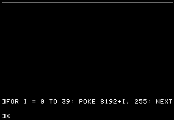
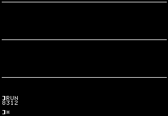

# Apple ]\[ hires
## Structure of the hires screen in RAM
The Apple ]\[ has 2 hires pages. One in $2000-$3FFF. The second one in $4000-$5FFF. Each page is thus 8192 bytes long.

The dimensions of one hires page is 40 bytes wide and 192 lines high. 40x192 = 7680 bytes. 512 bytes are "missing" and in fact not used/displayed.

The hires screen is divided in 3 sections of 64 lines. Each section is then divided in 8 sub-sections of 8 lines, each itself divided in 8 sub-sub-sections representing the lines themselves.

To better understand this division, it's easier to POKE bytes into RAM and see what happens.

A `POKE 8192,255`will plot 7 pixels on the top left corner of the hires screen (page 1). Poking the next memory address (8193), will plot 7 more pixels on line 0 of the hires screen.

So to draw the entire line 0 we could `RUN` this code

    10 HGR
    20 FOR I = 0 TO 39: POKE 8192+I, 255: NEXT

8192 + 40 = 8232 ($2028) is the next byte in memory. But

    POKE 8232,255

will not plot 7 pixels on line 1 but on line 64 !
If we slightly modify the above code to POKE the first 3 lines as stored in memory, we have

    10 HGR
    20 A = 8192: REM $2000
    30 FOR J = 0 TO 2
    40 FOR I = 0 TO 39
    50 POKE A, 255
    60 A = A + 1
    70 NEXT I,J
    80 PRINT A

The result is this

We have drawn line 0, line 64 and line 128 !
Now the next address to `POKE` seems to be 8312 ($2078 in hex -- the resulting value in our variable `A`).

But if we do `POKE 8312, 255` we don't see any change on the screen ! This is because we have reached one the hires screen holes !

In fact, all lines between 128 and 191 in RAM have 8 unused bytes at their end. Those 8x64 lines represent 512 bytes. Those are the missing bytes in first computation.

Now that we now that, we could slightly modify the above code so that after having drawn 3 lines, we add 8 to `A`so that it points to the next line location in memory. Let's do it and plot 3 times 3 lines.

    10 HGR
    20 A = 8192: REM $2000
    30 FOR K = 0 TO 2
    40 FOR J = 0 TO 2
    50 FOR I = 0 TO 39
    60 POKE A, 255
    70 A = A + 1
    80 NEXT I,J
    90 A = A + 8
    100 NEXT K
    110 PRINT A

We end up with

As you watch how the lines are filled, you better understand the hires screen structure: 
* the first 3 lines of 40 bytes delimit the three 64-lines sections and represent lines 0, 64 and 128 of the screen which are line 0 of each of the sections
* then 8 bytes are wasted
* the next 3 lines of 40 bytes represent line 8 of each of the 64 lines section (that is the base line of each section + 8, so we have lines 0+8, 64+8 and 128+8)
* then 8 bytes are wasted
* the next 3 lines of 40 bytes represent line 16 of each of the 64 lines section
* the 8 bytes are wasted
* This continues until we've arrived at line 56 relative to each section. That is line 56, line 64+56=120 and line 128+56=184.

The following code will do it

    10 HGR
    20 A = 8192: REM $2000
    30 FOR K = 0 TO 7
    40 FOR J = 0 TO 2
    50 FOR I = 0 TO 39
    60 POKE A, 255
    70 A = A + 1
    80 NEXT I,J
    90 A = A + 8
    100 NEXT K
    110 PRINT A

So what happens next ?
